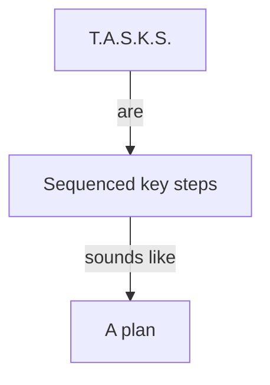
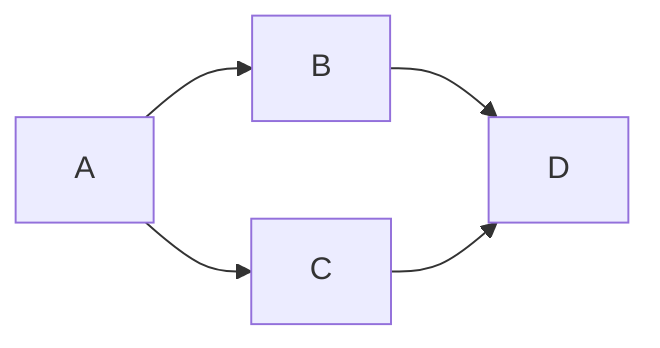
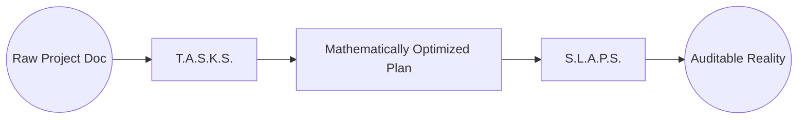

# T.A.S.K.S. + S.L.A.P.S.


A mathematically pure DAG planner + a resilient AI execution runtime.
Plan like a compiler. Execute like a swarm.




### **Plan. Execute. Heal.**
From project chaos to deterministic calm.

[](docs/v8/v8.md)
[](LICENSE)
[](docs/v8/v8.md)
[](docs/v8/v8.md)

### **Run It Like This: The T.A.S.K.S. Command Line Experience**

T.A.S.K.S. is designed to be accessible and powerful, whether you're using it as a Claude command or a dedicated CLI.

### **Planning with `/tasks` (Conceptual Claude Command)**

```
/tasks MIN_CONFIDENCE=0.7 MAX_WAVE_SIZE=30
[paste or attach your project document]
```
**Output:** 5 validated artifacts ready for execution, **automatically repaired if needed**.

### **Example: Self-Healed Execution Plan**

**Input:** Messy 2000-word project doc with multiple issues

```
❌ Initial Analysis: REJECT (Score: 58/100)
   • Cycle detected: P1.T014→P1.T022→P1.T018→P1.T014
   • 3 tasks missing evidence
   • 2 tasks >16h duration
   • 6 tasks not verb-first

🔧 Auto-Repair Level 1: Surgical Fixes
   ✅ Split P1.T022 (18h) → P1.T022a (8h) + P1.T022b (6h)
   ✅ Split P1.T014 (20h) → P1.T014a (6h) + P1.T014b (4h)
   ✅ Inserted PaymentsAPI:v1 interface between T014a→T022a
   ✅ Cycle resolved: DAG now acyclic

🔧 Auto-Repair Level 2: Quality Improvements  
   ✅ Added evidence for 3 tasks from lines 45-67, 123-134, 201-215
   ✅ Renamed: "User system" → "Implement user system"
   ✅ Renamed: "Database setup" → "Setup database schema"
   
✨ Final Result: GOOD (Score: 86/100)
   📊 20 tasks across 4 waves
   ⚡ Max 7 parallel tasks
   🎯 0 cycles, 95% verb-first compliance
   📋 Ready for execution
```

### **Visualizing the Pure DAG**

This is what your plan looks like under the hood. Pure DAG. No resource noise.




For more detailed CLI examples and usage patterns, see `docs/cli-demo.md`.

## **What is T.A.S.K.S. + S.L.A.P.S. v8.0?**

This specification defines a next-generation system for **AI-driven project planning and execution**. It transforms a high-level specification and a codebase into an optimized, audit-ready plan, and then executes it with a resilient, self-healing runtime.

### **Governing Principle: DAG Purity**
Precedence edges mean "must happen before," nothing more. Resource constraints are cataloged and enforced *adjacent to* the graph by the runtime, maximizing parallelism and keeping the plan mathematically valid.

### **T.A.S.K.S. (The Planner)**
A **self-healing project planning compiler** that applies computer science rigor to project management. It:
-   **Decomposes** complex goals into small, bounded tasks (2-8 hours).
-   **Infers and Minimizes** a pure precedence DAG (Directed Acyclic Graph).
-   **Validates** every task and dependency with machine-verifiable evidence.
-   **Automatically Repairs** common planning errors like cycles, oversized tasks, and missing evidence.
-   **Emits Canonical Artifacts** (features.json, tasks.json, dag.json, etc.) that are deterministic and hashed.

### **S.L.A.P.S. (The Executor)**
A **resilient execution runtime** that consumes the T.A.S.K.S. plan. It:
-   **Maintains a Rolling Frontier** of ready tasks, maximizing agent throughput.
-   **Arbitrates Resources** (locks, quotas) dynamically, preventing deadlocks and thrashing.
-   **Monitors Telemetry** for failure patterns and applies **Circuit Breakers** and **Hot Patches**.
-   **Records Provenance** with an append-only JSONL ledger for full auditability.




## **Why T.A.S.K.S. + S.L.A.P.S. v8.0?**

**Traditional project management and AI orchestration often fail due to:**
-   **Subjectivity:** Plans are based on vibes, not verifiable evidence.
-   **Rigidity:** Fixed waves and manual resource allocation lead to idle agents and bottlenecks.
-   **Fragility:** Systems break down when reality deviates from the plan, with no self-healing.
-   **Lack of Trust:** Non-deterministic outputs and missing provenance make auditing impossible.

**T.A.S.K.S. + S.L.A.P.S. solves this with:**
-   **🎯 DAG Purity:** Maximizes parallelism by separating precedence from resource constraints.
-   **🔄 Deterministic & Auditable:** Same input always yields the same hashed output; every execution step is logged.
-   **⚡ Rolling Frontier:** No idle agents; tasks are executed as soon as dependencies and resources allow.
-   **🛡️ Comprehensive Resilience:** Circuit breakers, hot patches, and compensation actions ensure plans survive contact with reality.
-   **🤖 Human + AI Synergy:** LLMs for creative decomposition, deterministic tools for validation and execution.

## **Core Features (v8.0 Specification)**

## **Dependencies & Quick Setup**

- Required to build/run planner:
  - `go` (version in `planner/go.mod`, currently Go 1.25+)
- Required to render DOT graphs to images:
  - `graphviz` (provides the `dot` command)

Install helpers:
- POSIX/macOS/Linux:
  - Check or install: `bash scripts/setup-deps.sh` (dry run)
  - Auto-install with prompts: `bash scripts/setup-deps.sh --install`
  - Non-interactive: `bash scripts/setup-deps.sh --install --yes`
- Windows (PowerShell):
  - Check: `pwsh -File scripts/setup-deps.ps1`
  - Install: `pwsh -File scripts/setup-deps.ps1 -Install -Yes`

Makefile shortcuts (POSIX):
- `make setup-dry-run` — checks for deps
- `make setup` — installs Graphviz (uses brew/apt/dnf/etc.)
- `make example-dot` — runs the example DOT export and render

Verify Graphviz:
- `dot -V` should print the Graphviz version

## **Contributing**

- Day‑to‑day planning uses a markdown‑first, Git‑native tracker under `todo/`.
- See `docs/todo-workflow.md` for task lifecycle, and use the scripts:
  - `npm run todo:task:set-active -- T###`
  - `npm run todo:task:set-finished -- T###`
  - `npm run todo:update`

## **Quick Start: Stub Planning Flow**

Until the full planner is complete, you can generate a stub plan and immediate DOT visualizations:

```
cd planner
go run ./cmd/tasksd plan --out ./plans                  # or: --doc ../my-spec.md --repo ..
# DOT files are emitted automatically next to JSON artifacts:
#  - ./plans/dag.dot (planning view)
#  - ./plans/runtime.dot (executor view)
# Render with Graphviz:
dot -Tsvg ./plans/dag.dot -o ./plans/dag.svg
dot -Tsvg ./plans/runtime.dot -o ./plans/runtime.svg
```

Stub planner flags:
- `--doc FILE` — optional Markdown spec; headings `##` become features; bullet items under a feature become tasks.
- `--repo DIR` — optional repo path; includes a small codebase census summary in tasks.json meta.
- `--out DIR` — output directory for artifacts.
- `--validators-acceptance CMD` — optional executable (path or shell command) invoked with JSON on stdin to validate acceptance checks; wrap complex shells as `sh -c "..."`.
- `--validators-evidence CMD` — optional validator command for evidence coverage; same invocation semantics as `--validators-acceptance`.
- `--validators-interface CMD` — optional validator command ensuring producer/consumer interface compatibility.
- `--validators-cache DIR` — filesystem directory for validator cache entries (created if missing, defaults to `~/.tasksd/validator-cache`).
- `--validators-timeout DURATION` — per-validator execution timeout (default `30s`).
- `--validators-strict` — when set, any validator failure aborts planning; otherwise failures are recorded in the plan but artifacts still emit.

Doc hints supported:
- Task duration hints: `- Build tables (3h)` or `- Index docs (90m)`
- Explicit dependencies per task: append `after: <Title or TID>[, ...]`
  - Example: `- Seed data after: Build tables, T002`


### 🧠 **Intelligent Planning (T.A.S.K.S.)**
-   **Codebase-First Analysis:** Integrates static analysis to ground plans in existing code.
-   **Evidence-Driven Decomposition:** Every task and dependency is backed by verifiable evidence.
-   **Smart Cycle Breaking:** Automated resolution of dependency cycles via task splitting or interface insertion.
-   **Resource-Aware Wave Simulation:** Forecasts contention without polluting the precedence DAG.

### ⚡ **Resilient Execution (S.L.A.P.S.)**
-   **Rolling Frontier Scheduler:** Maximizes throughput and minimizes agent idle time.
-   **Global Lock & Quota Managers:** Prevents deadlocks and manages finite resources.
-   **Circuit Breakers & Hot Patches:** Adapts to runtime failures by injecting remedial actions.
-   **Immutable Provenance Ledger:** Full audit trail of every execution step.

### 🛡️ **Quality & Trust**
-   **Deterministic Artifacts:** Canonical JSON serialization and SHA-256 hashing for all outputs.
-   **Normative Validators:** Acceptance, Evidence, and Interface validators ensure plan integrity.
-   **Security & Redaction:** Secrets are scrubbed from evidence before hashing.
-   **Human-in-the-Loop Checkpoints:** Mandatory human review at critical stages.

## Contributing

T.A.S.K.S. + S.L.A.P.S. is built on rigorous computer science principles. Contributions should maintain mathematical correctness, evidence-based validation, and enhance the auto-repair/self-healing capabilities.

See [CONTRIBUTING.md](CONTRIBUTING.md) for guidelines.

## License

MIT License - because good planning should be accessible to everyone.

---

**T.A.S.K.S. + S.L.A.P.S.** - *Where computer science meets project management, and AI meets reality.*

*"The best project plan is the one that survives contact with reality... and fixes itself when it doesn't."*

---

**Closing Note:**

This `README.md` is a living document, reflecting the ongoing evolution of T.A.S.K.S. and S.L.A.P.S. Your contributions are welcome to refine this vision and build the future of AI-driven project execution.

---

*"Sometimes the best systems aren't designed. They emerge.
Sometimes the best coordination isn't planned. It happens.
Sometimes the best code isn't written by one perfect developer.
It's written by 10 imperfect ones, working in beautiful chaos."*

**- The SLAPS Experiment**
**September 14, 2025**
**The day AI swarms became real**
