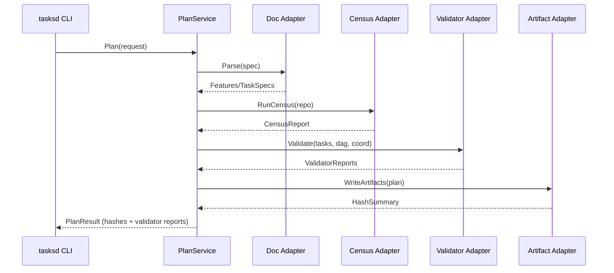

# Hexagonal Architecture Adoption Plan

## Why
- Preserve pure domain logic (planner + executor) while isolating environment-specific adapters (CLI, filesystem, validators).
- Improve unit-test coverage by swapping external services (validators, Graphviz export, todo scripts) with in-memory fakes.
- Enable future multi-platform runtimes (daemon, API) without rewriting business logic.

## Current State Snapshot
- `cmd/tasksd` mixes CLI flag parsing, planning orchestration, artifact writing, and validator invocation.
- Planner internals already have separable responsibilities (`analysis`, `docparse`, `dag`, `validators`, `emitter`), but dependencies are direct package imports.
- External concerns (I/O, subprocess exec, cache) are invoked inline; swapping them requires integration tests.

## Target Architecture Overview
```mermaid
flowchart TD
    subgraph ApplicationLayer[Application Services]
        planSvc[PlanService]
        exportSvc[ExportService]
    end
    subgraph DomainCore[Domain Core (pure Go)]
        plannerEngine[Planner Engine]
        executorEngine[Executor Engine]
    end
    subgraph Ports[Ports / Adapters]
        docPort[DocPort]
        validatorPort[ValidatorPort]
        artifactPort[ArtifactPort]
        analysisPort[AnalysisPort]
        telemetryPort[TelemetryPort]
    end

    planSvc --> plannerEngine
    exportSvc --> plannerEngine
    plannerEngine --> validatorPort
    plannerEngine --> docPort
    plannerEngine --> analysisPort
    plannerEngine --> artifactPort
    executorEngine --> validatorPort
    executorEngine --> telemetryPort
    artifactPort -->|writes| Storage[(Artifacts)]
    validatorPort -->|delegates| Validators[(Acceptance/Evidence/Interface Tools)]
```
Ports / adapters:
- **DocPort**: parse requests (file, string, remote spec) -> `[]Feature`, `[]TaskSpec`.
- **ValidatorPort**: acceptance/evidence/interface validators; default adapter uses subprocess, future adapters may call HTTP services.
- **ArtifactPort**: persistence for artifacts (filesystem today, future memory/remote).
- **AnalysisPort**: wraps repo census + interface scanners.
- **Logging/Telemetry Port**: attaches structured output for plan/executor.

## Incremental Steps
1. **Introduce Service Layer (PlanningService)**
   - Create `internal/app/plan` package that orchestrates doc parsing, analysis, DAG build, validator orchestration, and artifact emission.
   - Define service input/output structs (plan request, plan result) to decouple CLI flag parsing.
2. **Define Port Interfaces**
   - Add `internal/ports` module summarizing port contracts: `DocPort`, `ValidatorPort`, `ArtifactPort`, `CensusPort`, `WavePort`.
   - Provide a default filesystem/docparse adapter for DocPort and subprocess validator adapter for ValidatorPort (reuse new validator runner).
3. **Refactor CLI/commands to use Services**
   - Update `cmd/tasksd` commands (`plan`, `export-dot`, `validate`) to instantiate adapters, inject into service, and handle logging only.
   - Ensure CLI parsing remains ergonomic (flags map to service config) while domain code becomes testable in isolation.
4. **Executor Alignment (Phase 2)**
   - Introduce `internal/app/exec` service for the rolling frontier, with ports for artifacts, telemetry, resource catalogs, and acceptance execution.
   - Reuse ValidatorPort for runtime acceptance reruns.
5. **Testing & QA Story**
   - Build in-memory/mocked adapters (e.g., stub validator returning canned responses) to enable deterministic unit testing.
   - Add service-level integration tests that assert artifacts and validator reports without touching disk.
6. **Migration Cleanup**
   - Remove deprecated helper functions from CLI once services are stable.
   - Document adapter injection in README and ensure docs/go-architecture references new module layout.

## Milestone Draft
- **M3.1 (current branch)**: validator adapter and caching (complete via T070).
- **M3.2**: add PlanningService + ports; CLI still uses helpers but delegates validators via service.
- **M3.3**: move artifact emission + DOT export into ArtifactPort adapters; update docs.
- **M4.x**: create ExecutorService for SLAPS, bringing executor onto hexagonal baseline.
- **M5**: finalize adapter registry, add HTTP validator adapter example, align CI/automation.

## Open Questions
- Do we version ports (e.g., validator API) to track upstream external tool changes?
- Should artifact writer remain a shared adapter or become part of the domain core?
- How to stage executor hexagonalization without blocking validator-focused milestone?
- Where should caching (validators, census, doc parsing) live—inside adapters or as middleware around the service?

## References
- docs/formal-spec.md §§3-15 — deterministic artifacts, validators, execution contract.
- docs/go-architecture.md §"Validators" / §"Resource modeling".
- README.md (stub CLI usage / validator flags).

## Appendix: Adapter Interactions


