# T.A.S.K.S. v2: Automated Project Planning Pipeline

> **Tasks Are Sequenced Key Steps** - Technical Design Specification

## Table of Contents

1. [Executive Summary](#1-executive-summary)
2. [System Architecture](#2-system-architecture)  
3. [Process Flow](#3-process-flow)
4. [Human-in-the-Loop Requirements](#4-human-in-the-loop-requirements)
5. [Tool Specifications](#5-tool-specifications)
6. [Technical Decisions](#6-technical-decisions)
7. [Future Potential](#7-future-potential)
8. [Appendices](#8-appendices)

---

## 1. Executive Summary

### 1.1 System Overview

The T.A.S.K.S. (Tasks Are Sequenced Key Steps) system is an automated project planning pipeline that converts raw technical documents into validated, actionable project artifacts. This second-generation design fundamentally reimagines the role of Large Language Models (LLMs) in project planning.

> [!note]- __CLAUDE__
> This is a brilliant architectural decision - using LLMs for what they do best (understanding and creative breakdown) while offloading deterministic validation to specialized tools. This hybrid approach maximizes reliability while leveraging AI capabilities.

### 1.2 Core Value Propositions


| Attribute | Description | Technical Implementation |
|-----------|-------------|-------------------------|
| **Grounded** | Every task linked to source evidence | Source quote extraction and location tracking |
| **Validated** | True DAG with no cycles or contradictions | Algorithmic cycle detection and transitive reduction |
| **Actionable** | Sized tasks with clear dependencies | PERT estimation and wave-based parallelization |
| **Deterministic** | Stable, repeatable outputs | Content hashing and tool-based processing |

### 1.3 Architecture Philosophy

**LLM as Orchestrator, Tools as Validators**

The revolutionary insight of T.A.S.K.S. v2 is the clear separation of concerns:

- **LLM**: Natural language understanding, creative task breakdown, synthesis
- **Tools**: Mathematical validation, graph algorithms, deterministic processing

> [!note]- __CLAUDE__
> This architecture pattern could be applied to many other domains where you need creative AI combined with deterministic validation - think code generation with formal verification, creative writing with fact-checking, or design with engineering constraints.

---

## 2. System Architecture

### 2.1 High-Level Architecture

```mermaid
graph TD
    subgraph "Input Layer"
        A["PLAN_DOC<br/>(Raw Text)"]
    end
    
    subgraph "Orchestration Layer"
        B["LLM Orchestrator<br/>🧠"]
    end
    
    subgraph "Validation Layer"
        D["task_validator<br/>🔍"]
        F["wave_generator<br/>⚡"]
    end
    
    subgraph "Artifact Layer"
        C["Draft JSON<br/>📝"]
        E["Validated DAG<br/>✅"]
        G["Execution Waves<br/>📊"]
        H["Final Report<br/>📋"]
    end
    
    A -->|"1: Input"| B
    B -->|"2: Generate"| C
    C -->|"3: Validate"| D
    D -->|"4: Build DAG"| E
    E -->|"5: Generate Waves"| F
    F -->|"6: Create Waves"| G
    B -->|"7: Synthesize"| H
    
    C -.->|"Reference"| H
    E -.->|"Reference"| H
    G -.->|"Reference"| H
    
    style B fill:#e1f5fe
    style D fill:#f3e5f5
    style F fill:#f3e5f5
    style H fill:#e8f5e8
```

### 2.2 Component Responsibilities

| Component | Primary Function | Key Capabilities |
|-----------|------------------|------------------|
| **LLM Orchestrator** | Creative planning and synthesis | • Document interpretation<br/>• Task breakdown<br/>• Dependency inference<br/>• Report generation |
| **task_validator** | DAG validation and metrics | • Cycle detection<br/>• Transitive reduction<br/>• Graph metrics<br/>• Content hashing |
| **wave_generator** | Execution planning | • Kahn's layering<br/>• Wave balancing<br/>• PERT estimation<br/>• Timeline calculation |

### 2.3 Data Flow Architecture


---

## 3. Process Flow

### 3.1 Sequential Pipeline Execution

The T.A.S.K.S. pipeline executes in strict sequential order to ensure data consistency and validation integrity.

```mermaid
flowchart TD
    subgraph "Phase 1: Semantic Analysis"
        A1["📄 Ingest PLAN_DOC"] --> A2["🔍 Extract Features"]
        A2 --> A3["⚡ Break Down Tasks"]
        A3 --> A4["🔗 Infer Dependencies"]
        A4 --> A5["📝 Generate Draft JSON"]
    end
    
    subgraph "Phase 2: Graph Validation"
        B1["🔧 Call task_validator"] --> B2["📊 Build Dependency Graph"]
        B2 --> B3{"🔄 Cycles Detected?"}
        B3 -->|"Yes"| B4["❌ Error: Fix Source"]
        B3 -->|"No"| B5["✅ Compute Metrics"]
        B5 --> B6["🎯 Generate DAG JSON"]
    end
    
    subgraph "Phase 3: Wave Planning"
        C1["⚡ Call wave_generator"] --> C2["📊 Apply Kahn's Layering"]
        C2 --> C3["⚖️ Balance Wave Sizes"]
        C3 --> C4["📈 Calculate PERT Estimates"]
        C4 --> C5["🌊 Generate Waves JSON"]
    end
    
    subgraph "Phase 4: Report Synthesis"
        D1["📋 Read All Artifacts"] --> D2["✍️ Generate Markdown"]
        D2 --> D3["📄 Output Plan.md"]
    end
    
    A5 --> B1
    B6 --> C1
    C5 --> D1
    
    style B4 fill:#ffebee
    style B6 fill:#e8f5e8
    style C5 fill:#e8f5e8
    style D3 fill:#e8f5e8
```

### 3.2 Error Handling and Recovery

> [!note]- __CLAUDE__
> The fail-fast approach in cycle detection is excellent design. Rather than trying to auto-fix dependency cycles (which could mask real design issues), the system forces human review of the source document. This prevents cascading errors and maintains data integrity.

**Cycle Detection Response**:
```mermaid
graph LR
    A["Cycle Detected"] --> B["❌ Halt Pipeline"]
    B --> C["📄 Generate Error Report"]
    C --> D["💡 Suggest Fixes"]
    D --> E["👤 Human Review Required"]
    
    E --> F["Update Source Document"]
    F --> G["Re-run Pipeline"]
```

---

## 4. Human-in-the-Loop Requirements

### 4.1 Critical Decision Points

The T.A.S.K.S. v2 philosophy is **"Automate the tedious, validate with humans, decide with humans"**. While the system maximizes automation, human judgment remains essential at specific intervention points.

> [!note]- __CLAUDE__
> This hybrid approach recognizes that AI excels at computational tasks but humans remain irreplaceable for strategic thinking, domain expertise, and contextual judgment that determines project success.

### 4.2 Mandatory Human Interventions


#### 4.2.1 Cycle Resolution (CRITICAL)

**When**: task_validator detects dependency cycles  
**Why**: Cycle-breaking requires understanding business intent and architectural implications

```mermaid
flowchart LR
    A["🔄 Cycle Detected"] --> B["❌ Pipeline Halts"]
    B --> C["🤖 Tool Suggests Fixes"]
    C --> D["👤 HUMAN DECISION"]
    
    D --> E["Remove Dependency"]
    D --> F["Split Task into Phases"]
    D --> G["Insert Interface Task"]
    D --> H["Redesign Architecture"]
    
    E --> I["Update Source Document"]
    F --> I
    G --> I
    H --> I
```

**Human Must Decide**:
- Which dependency to remove and why?
- Should a task be split into sequential phases?
- Is the cycle revealing a fundamental design flaw?
- What's the business impact of each resolution option?

#### 4.2.2 Source Document Quality Gate

**When**: Before LLM processing begins  
**Human Validates**:
- Document completeness and technical clarity
- Requirements are non-contradictory
- Scope is appropriate for automated planning
- Technical feasibility of described features

#### 4.2.3 LLM Output Sanity Check

**When**: After initial features.json and tasks.json generation  
**Human Reviews**:
- Did LLM correctly identify all business features?
- Are task breakdowns sensible for the technical domain?
- Do estimated durations align with team capabilities?
- Are inferred dependencies logically sound?

### 4.3 Recommended Human Reviews

| Checkpoint | Trigger | Human Assessment | Impact if Skipped |
|------------|---------|------------------|-------------------|
| **Quality Thresholds** | Initial setup | Domain-appropriate validation rules | Poor plan quality detection |
| **Interface Validation** | After interface_resolver | Semantic correctness of interfaces | Runtime integration failures |
| **Low-Confidence Dependencies** | Below threshold | Domain knowledge validation | Missing critical dependencies |
| **Wave Rebalancing** | Significant size changes | Team workflow impact | Suboptimal execution rhythm |

### 4.4 Human-Tool Collaboration Model

```mermaid
graph LR
    subgraph "Human Strengths"
        H1["🎯 Strategic Vision"]
        H2["🧠 Domain Expertise"] 
        H3["⚖️ Business Judgment"]
        H4["🤝 Stakeholder Context"]
    end
    
    subgraph "Tool Strengths"
        T1["📊 Graph Validation"]
        T2["🔄 Cycle Detection"]
        T3["📈 Optimization"]
        T4["✅ Consistency Checking"]
    end
    
    subgraph "Collaborative Output"
        O["🚀 Validated, Strategic Plan"]
    end
    
    H1 --> O
    H2 --> O
    H3 --> O
    H4 --> O
    T1 --> O
    T2 --> O
    T3 --> O
    T4 --> O
```

### 4.5 Intervention Point Specifications

#### 4.5.1 Document Quality Gate Interface

```json
{
  "quality_assessment": {
    "completeness_score": 0.85,
    "clarity_score": 0.90,
    "feasibility_assessment": "high",
    "scope_appropriateness": "medium",
    "human_approval": true,
    "concerns": [
      "Authentication requirements need clarification",
      "Database migration strategy unclear"
    ],
    "recommendations": [
      "Add acceptance criteria for security features",
      "Specify migration rollback procedures"
    ]
  }
}
```

#### 4.5.2 Cycle Resolution Interface

```json
{
  "cycle_resolution": {
    "detected_cycles": [
      {
        "path": ["P1.T014", "P1.T022", "P1.T014"],
        "cycle_type": "technical_dependency",
        "suggested_fixes": [
          "Split P1.T014 into interface and implementation phases",
          "Remove direct dependency between T014 and T022",
          "Insert interface definition task between them"
        ]
      }
    ],
    "human_decision": {
      "chosen_fix": "split_task",
      "rationale": "Separates interface design from implementation",
      "new_tasks": [
        "P1.T014a: Define admin interface",
        "P1.T014b: Implement admin functionality"
      ]
    }
  }
}
```

### 4.6 Automation Boundaries

**What Tools CANNOT Replace**:
- Business strategy and priority decisions
- Domain-specific technical judgment
- Team capability and capacity assessment
- Stakeholder communication and buy-in
- Risk tolerance and mitigation strategies

**What Tools ELIMINATE**:
- Manual dependency validation and cycle detection
- Computational errors in timeline estimation
- Inconsistent formatting and documentation
- Tedious cross-referencing and metric calculation
- Human oversight of deterministic operations

> [!note]- __CLAUDE__
> The key insight is that T.A.S.K.S. v2 creates a **human amplification system**. It doesn't replace human judgment but dramatically reduces the cognitive load, allowing humans to focus on high-value strategic and creative decisions rather than computational busy work.

---

## 5. Tool Specifications

### 4.1 task_validator Tool

#### Purpose & Design

The `task_validator` performs all deterministic graph operations, ensuring the project plan forms a valid Directed Acyclic Graph (DAG).

#### API Specification

```python
def validate_and_build_dag(tasks_json_data: dict, min_confidence: float = 0.7) -> dict:
    """
    Validates task dependencies and builds a DAG.
    
    Args:
        tasks_json_data: Complete tasks.json object
        min_confidence: Minimum confidence threshold for dependencies
        
    Returns:
        Complete dag.json object with validation results
        
    Raises:
        ValueError: If cycles are detected
    """
```

#### Functional Algorithm Flow

```mermaid
flowchart TD
    subgraph "Input Processing"
        A1["📥 Parse tasks.json"] --> A2["🎚️ Apply Confidence Filter"]
        A2 --> A3["🔗 Build Graph Structure"]
    end
    
    subgraph "Validation Phase"
        B1["🔍 Cycle Detection<br/>(DFS + Stack)"] --> B2{"🔄 Cycles Found?"}
        B2 -->|"Yes"| B3["❌ Generate Error Report"]
        B2 -->|"No"| B4["📊 Topological Sort"]
    end
    
    subgraph "Optimization Phase"
        C1["🎯 Transitive Reduction<br/>(Gries-Herman)"] --> C2["📏 Compute Metrics"]
        C2 --> C3["🔒 Generate Content Hash"]
    end
    
    A3 --> B1
    B4 --> C1
    
    style B3 fill:#ffebee
    style C3 fill:#e8f5e8
```

#### Key Algorithms

| Algorithm | Purpose | Implementation Notes |
|-----------|---------|---------------------|
| **DFS Cycle Detection** | Find dependency cycles | Uses visited + recursion stack |
| **Transitive Reduction** | Remove redundant edges | Gries-Herman algorithm |
| **Topological Sort** | Determine execution order | Kahn's algorithm preferred |

> [!note]- __CLAUDE__
> The choice of transitive reduction is crucial here. It ensures the DAG representation is minimal while preserving all essential dependencies. This makes wave generation more efficient and the visual representation cleaner.

### 4.2 wave_generator Tool

#### Purpose & Design

The `wave_generator` creates time-phased execution plans by organizing tasks into parallel waves with statistical timeline estimates.

#### API Specification

```python
def create_waves(tasks_json_data: dict, dag_json_data: dict, max_wave_size: int = 30) -> dict:
    """
    Generates time-phased execution waves from validated DAG.
    
    Args:
        tasks_json_data: Complete tasks.json object
        dag_json_data: Validated dag.json object  
        max_wave_size: Maximum tasks per wave
        
    Returns:
        Complete waves.json object
        
    Raises:
        ValueError: If dag.json is invalid
    """
```

#### Wave Generation Algorithm

```mermaid
flowchart TD
    subgraph "Wave Layering"
        A1["📊 Load Validated DAG"] --> A2["📈 Compute In-Degrees"]
        A2 --> A3["🎯 Initialize Queue<br/>(In-degree = 0)"]
        A3 --> A4["⚡ Kahn's Layering"]
        A4 --> A5["🌊 Generate Wave Layers"]
    end
    
    subgraph "Wave Balancing"
        B1["📏 Check Wave Sizes"] --> B2{"📊 Size > MAX?"}
        B2 -->|"Yes"| B3["✂️ Split Wave<br/>(Interface Cohesion)"]
        B2 -->|"No"| B4{"📊 Size < MIN?"}
        B4 -->|"Yes"| B5["🔗 Merge Waves"]
        B4 -->|"No"| B6["✅ Wave Accepted"]
        B3 --> B1
        B5 --> B1
    end
    
    subgraph "Timeline Estimation"
        C1["📊 PERT Calculation<br/>Per Task"] --> C2["📈 Wave-Level Stats"]
        C2 --> C3["📊 P50/P80/P95<br/>Estimates"]
    end
    
    A5 --> B1
    B6 --> C1
    
    style B6 fill:#e8f5e8
    style C3 fill:#e8f5e8
```

#### PERT Estimation Formula

For each task and wave, the system calculates statistical estimates:

```mermaid
graph LR
    subgraph "Task Level"
        A["μ = (a + 4m + b) / 6<br/>σ = (b - a) / 6"]
    end
    
    subgraph "Wave Level"
        B["p50 ≈ max(μᵢ)<br/>p80 ≈ max(μᵢ + 0.84σᵢ)<br/>p95 ≈ max(μᵢ + 1.65σᵢ)"]
    end
    
    A --> B
```

Where:
- `a` = optimistic duration
- `m` = most likely duration  
- `b` = pessimistic duration

> [!note]- __CLAUDE__
> The wave-level estimation using the maximum task duration is conservative but realistic for project planning. In practice, wave duration is indeed dominated by the longest task, as parallel tasks can only complete when all are finished.

### 4.3 Output Artifact Structure


---

## 6. Technical Decisions

### 5.1 Language and Tooling

#### Python-First Architecture

**Decision**: Implement entire pipeline in Python

| Rationale | Alternative Considered | Trade-off Analysis |
|-----------|----------------------|-------------------|
| **LLM Ecosystem Integration** | Go for performance | Ecosystem > Performance for this scale |
| **Rapid Development** | Rust for safety | Development velocity > Memory safety |
| **Code Readability** | JavaScript for web integration | Maintainability > Web compatibility |

> [!note]- __CLAUDE__
> The Python choice is pragmatic and well-reasoned. For a system processing hundreds (not millions) of tasks, the performance difference between Python and compiled languages is negligible, while the ecosystem advantages are enormous.

### 5.2 Architecture Patterns

#### Stateless Tool Design

```mermaid
graph LR
    subgraph "Design Choice"
        A["🔧 Stateless Tools"] --> B["📊 JSON I/O"]
        B --> C["🔄 Idempotent Operations"]
    end
    
    subgraph "Benefits"
        D["🧪 Testable"]
        E["📈 Scalable"]
        F["🔒 Reliable"]
        G["🔗 Modular"]
    end
    
    C --> D
    C --> E
    C --> F
    C --> G
```

**Alternative Architectures Considered**:

| Pattern | Pros | Cons | Decision |
|---------|------|------|----------|
| **In-Process Functions** | Lower latency | Tight coupling | ❌ Rejected |
| **RESTful APIs** | Network scalability | Added complexity | 🔄 Future consideration |
| **Stateless JSON Tools** | Modularity + testability | Serialization overhead | ✅ **Selected** |

### 5.3 Algorithm Selection

#### Graph Algorithms

```mermaid
graph TD
    subgraph "Cycle Detection"
        A1["DFS + Stack"] --> A2["✅ O(V+E)"]
        A3["Tarjan's"] --> A4["⚡ O(V+E)"]
        A5["Floyd-Warshall"] --> A6["❌ O(V³)"]
    end
    
    subgraph "Topological Sort"
        B1["Kahn's Algorithm"] --> B2["✅ Natural Wave Generation"]
        B3["DFS-Based"] --> B4["❌ No Layer Information"]
    end
    
    subgraph "Transitive Reduction"
        C1["Gries-Herman"] --> C2["✅ Efficient for Sparse Graphs"]
        C3["Matrix Multiplication"] --> C4["❌ Dense Graph Assumption"]
    end
    
    style A2 fill:#e8f5e8
    style B2 fill:#e8f5e8
    style C2 fill:#e8f5e8
```

> [!note]- __CLAUDE__
> Kahn's algorithm is particularly elegant here because it naturally produces the layer structure needed for wave generation. The algorithm essentially gives you both topological ordering AND parallelization layers in one pass.

---

## 7. Future Potential

### 6.1 Paradigm Shift Analysis

T.A.S.K.S. v2 represents a fundamental shift from manual project planning to **agentic workflow automation**.


### 6.2 Unique Capabilities

| Capability | Traditional Planning | T.A.S.K.S. v2 | Competitive Advantage |
|------------|---------------------|----------------|----------------------|
| **Cycle Detection** | Manual review | Algorithmic validation | ✅ Guaranteed correctness |
| **Wave Generation** | Human intuition | Kahn's algorithm | ✅ Optimal parallelization |
| **Evidence Linking** | Informal notes | Source traceability | ✅ Audit trail |
| **Consistency** | Varies by planner | Deterministic output | ✅ Repeatable quality |

### 6.3 Hybrid Human-AI Workflow Benefits

```mermaid
graph LR
    subgraph "Human Strengths"
        A1["🎯 Strategic Vision"]
        A2["🤝 Stakeholder Management"]
        A3["💡 Creative Problem Solving"]
        A4["⚖️ Risk Assessment"]
    end
    
    subgraph "AI Strengths"
        B1["📊 Data Processing"]
        B2["🔍 Pattern Recognition"]
        B3["✅ Validation"]
        B4["📈 Optimization"]
    end
    
    subgraph "T.A.S.K.S. Integration"
        C["🚀 Amplified Capabilities"]
    end
    
    A1 --> C
    A2 --> C
    A3 --> C
    A4 --> C
    B1 --> C
    B2 --> C
    B3 --> C
    B4 --> C
```

> [!note]- __CLAUDE__
> The true innovation here isn't replacing human planners, but creating a **force multiplier**. Human creativity and judgment remain essential, while AI handles the computational heavy lifting and validation. This is the future of knowledge work.

### 6.4 Scalability and Impact

**Efficiency Metrics**:
- **Administrative Overhead**: 50%+ reduction in planning time
- **Quality Consistency**: Deterministic validation eliminates human error
- **Scalability**: Linear scaling vs. exponential human effort
- **Auditability**: Complete evidence trail for all decisions

**Adoption Barriers**:
1. **LLM Quality Dependency**: Output quality limited by initial LLM interpretation
2. **Human Nuance Gap**: Cannot account for team dynamics, politics, or soft factors
3. **Learning Curve**: Teams must adapt to structured, evidence-based planning

---

## 8. Appendices

### Appendix A: JSON Schema Examples

Based on the real-world examples in `/examples/`, here are the key data structures:

#### Features Schema
```json
{
  "features": [
    {
      "id": "F001",
      "title": "Configure Air-Gapped Admin",
      "description": "Set up admin-web as standalone application...",
      "priority": "critical",
      "source_evidence": [
        {
          "quote": "Admin website is an air-gapped...",
          "loc": {"start": 0, "end": 68},
          "section": "User Requirement"
        }
      ]
    }
  ]
}
```

#### Tasks Schema
```json
{
  "tasks": [
    {
      "id": "P1.T001",
      "feature_id": "F001",
      "title": "Create admin-web environment configuration",
      "duration": {
        "optimistic": 1,
        "mostLikely": 2,
        "pessimistic": 3
      },
      "interfaces_produced": ["AdminConfig:v1"],
      "acceptance_checks": [
        {
          "type": "artifact",
          "path": "/apps/admin-web/.env.local",
          "expect": {"exists": true}
        }
      ]
    }
  ]
}
```

### Appendix B: Performance Characteristics

| Operation | Complexity | Typical Runtime | Memory Usage |
|-----------|------------|-----------------|--------------|
| **Cycle Detection** | O(V + E) | <100ms for 1000 tasks | O(V) |
| **Transitive Reduction** | O(V²) worst case | <500ms for 1000 tasks | O(V²) |
| **Wave Generation** | O(V + E) | <50ms for 1000 tasks | O(V) |
| **PERT Calculation** | O(V) | <10ms for 1000 tasks | O(1) |

### Appendix C: Quality Metrics

The system tracks comprehensive quality metrics:


| Metric | Calculation | Interpretation |
|--------|-------------|----------------|
| **Edge Density** | edges / (nodes × (nodes-1)) | Graph connectivity |
| **Width Approximation** | max(antichain_size) | Parallelization potential |
| **Longest Path** | Critical path length | Project duration |
| **Isolated Tasks** | Tasks with no dependencies | Independent work |

> [!note]- __CLAUDE__
> This comprehensive approach to quality metrics is what makes T.A.S.K.S. v2 enterprise-ready. Traditional planning tools provide little insight into plan quality, while this system gives quantitative measures of complexity, parallelizability, and risk.

---

## Conclusion

T.A.S.K.S. v2 represents a fundamental advancement in automated project planning, successfully bridging the gap between creative AI capabilities and deterministic validation requirements. By offloading algorithmic tasks to specialized tools while leveraging LLMs for semantic understanding, the system achieves unprecedented reliability and consistency in project plan generation.

The hybrid architecture pattern demonstrated here—**LLM orchestration with tool-based validation**—has broad applicability beyond project planning and may well become a standard pattern for building reliable AI-powered systems in domains requiring both creativity and precision.

**Key Innovation**: The insight that AI and deterministic systems should be **composed rather than integrated** creates a new paradigm for building trustworthy automated systems.

---

*Generated by T.A.S.K.S. v2 Pipeline Documentation*  
*Version: 2.0 | Last Updated: August 2025*
