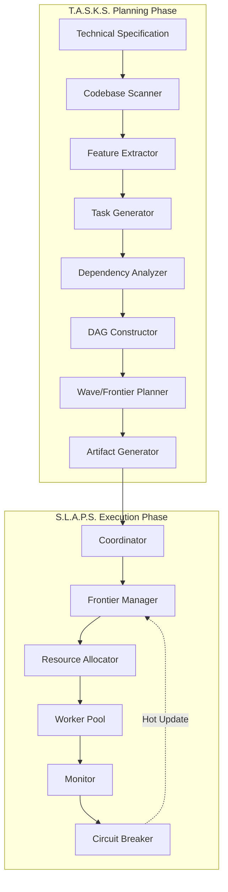
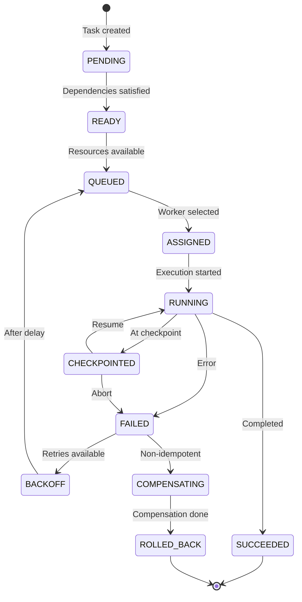

# **T.A.S.K.S. + S.L.A.P.S. Technical Specification v5.0**

## **Formal System Definition & Implementation Guide**

**Document Version:** 5.0  
**Status:** Normative  
**Date:** 2025-10-04  
**Authors:** Technical Standards Committee

---

## **Table of Contents**

1. [Introduction & Scope](#1-introduction--scope)
2. [System Architecture](#2-system-architecture)
3. [Data Contracts & Schemas](#3-data-contracts--schemas)
4. [T.A.S.K.S. Planning Engine](#4-tasks-planning-engine)
5. [S.L.A.P.S. Execution Runtime](#5-slaps-execution-runtime)
6. [Logging & Telemetry](#6-logging--telemetry)
7. [Deterministic Output & Hashing](#7-deterministic-output--hashing)
8. [Validation & Quality Gates](#8-validation--quality-gates)
9. [Error Handling & Recovery](#9-error-handling--recovery)
10. [Implementation Requirements](#10-implementation-requirements)
11. [Reference Algorithms](#11-reference-algorithms)
12. [Testing & Compliance](#12-testing--compliance)
13. [Appendices](#13-appendices)

---

## **1. Introduction & Scope**

### **1.1 Purpose**

This document defines the complete technical specification for T.A.S.K.S. (Tasks Are Sequenced Key Steps) and S.L.A.P.S. (Sounds Like A Plan System), a dual-phase project planning and execution framework.

### **1.2 Normative vs. Informative**

- **MUST**, **REQUIRED**, **SHALL**: Mandatory requirements
- **SHOULD**, **RECOMMENDED**: Best practices; deviation requires justification
- **MAY**, **OPTIONAL**: Discretionary implementation choices
- **Informative sections**: Marked with ℹ️ prefix

### **1.3 System Overview**



### **1.4 Design Principles**

1. **Evidence-First**: Every task and dependency MUST cite source evidence
2. **Deterministic**: Identical inputs produce byte-identical outputs
3. **Resource-Aware**: Model real constraints (locks, quotas, capacity)
4. **Codebase-First**: Inventory existing code before planning
5. **Bounded Tasks**: Every task has explicit complexity, scope, and completion criteria
6. **Machine-Verifiable**: All acceptance criteria must be automatable

### **1.5 Terminology**

|Term|Definition|
|---|---|
|**Feature**|User-visible capability or infrastructure component (5-25 per plan)|
|**Task**|Atomic unit of work (2-8h typical, 16h max)|
|**Hard Dependency**|Blocking prerequisite (confidence ≥ MIN_CONFIDENCE, isHard=true)|
|**Soft Dependency**|Advisory ordering hint (confidence < MIN_CONFIDENCE or isHard=false)|
|**Wave**|Synchronized batch of tasks with barrier synchronization|
|**Frontier**|Set of tasks with all dependencies satisfied, awaiting resources|
|**Resource**|Shared infrastructure (exclusive lock or limited capacity)|
|**Evidence**|Source citation supporting a task or dependency claim|
|**Artifact**|Generated output file (JSON or Markdown)|
|**Coordinator**|Central orchestrator managing execution state|
|**Worker**|Agent executing tasks with specific capabilities|

---

## **2. System Architecture**

### **2.1 Component Responsibilities**

#### **2.1.1 T.A.S.K.S. Planning Engine**

**Inputs:**

- `PLAN_DOC` (raw technical specification, Markdown/text)
- `CODEBASE_PATH` (repository root for analysis)
- `MIN_CONFIDENCE` (threshold for DAG inclusion, default: 0.7)
- `MAX_WAVE_SIZE` (tasks per wave, default: 30)
- `EXECUTION_MODEL` (`wave_based` | `rolling_frontier`, default: `rolling_frontier`)
- `MAX_CONCURRENT_TASKS` (for rolling frontier, default: 10)

**Outputs:**

- `features.json` (5-25 features with evidence)
- `tasks.json` (complete task definitions with boundaries)
- `dag.json` (dependency graph + metrics)
- `waves.json` (execution strategies for both models)
- `coordinator.json` (runtime configuration)
- `Plan.md` (human-readable narrative)
- `Decisions.md` (design rationale)

**Core Functions:**

1. Codebase scanning (AST analysis)
2. Feature extraction (NLP/pattern matching)
3. Task decomposition (bounded, measurable units)
4. Dependency inference (structural + resource)
5. DAG construction (cycle detection, transitive reduction)
6. Wave planning (resource-aware layering)
7. Artifact generation (deterministic serialization)

#### **2.1.2 S.L.A.P.S. Execution Runtime**

**Inputs:**

- `coordinator.json` (from T.A.S.K.S.)
- Task execution agents (worker pool)
- Resource definitions (locks, quotas)

**Outputs:**

- JSONL execution logs
- Provenance records
- Checkpoint snapshots
- Final execution report

**Core Functions:**

1. Frontier management (ready queue + priority)
2. Resource allocation (locks, quotas, deadlock avoidance)
3. Worker dispatch (capability-based assignment)
4. Event processing (completions, failures, checkpoints)
5. Circuit breaking (pattern detection, remediation)
6. Hot updates (dynamic plan modification)
7. Rollback & compensation (failure recovery)

### **2.2 Execution Models**

#### **2.2.1 Wave-Based Execution**

```
Wave 1: [T1, T2, T3] → Barrier (95% quorum) → 
Wave 2: [T4, T5, T6, T7] → Barrier (95% quorum) →
...
Wave N: [Tn-2, Tn-1, Tn] → Complete
```

**Characteristics:**

- Synchronous phases with explicit barriers
- Simple coordination (wait for wave completion)
- Predictable resource usage per wave
- Lower parallelism (artificial serialization)
- Good for: phased rollouts, regulatory compliance, strict checkpoints

#### **2.2.2 Rolling Frontier Execution**

```
Frontier: {T1, T2, T3} (ready, waiting resources)
Running: {T4, T5}
Blocked: {T6→T4, T7→T5, T8→T4,T5}

Event: T4 completes → Frontier += {T6}, Running += {T3}
Event: T5 completes → Frontier += {T7}, Running += {T1}
Event: T6,T7 complete → Frontier += {T8}
```

**Characteristics:**

- Continuous flow (no artificial barriers)
- Resource-aware (locks, quotas, backpressure)
- Maximum parallelism (optimal makespan)
- Complex coordination (dynamic frontier)
- Good for: speed, efficiency, adaptive execution

### **2.3 Data Flow**

```
PLAN_DOC (text)
    ↓
[T.A.S.K.S. Scanning] → Codebase Inventory
    ↓
[T.A.S.K.S. Planning] → {features, tasks, dag, waves, coordinator}.json
    ↓
[Human Review] → Approve/Modify/Reject
    ↓
[S.L.A.P.S. Init] → Load coordinator.json, initialize state
    ↓
[S.L.A.P.S. Loop] → Frontier update → Resource check → Dispatch → Events
    ↓                      ↑
[Workers] → Execute → Log (JSONL) → Complete/Fail
    ↓
[Circuit Breaker] → Detect pattern → Hot update → Inject tasks/edges
    ↓
[Completion] → Provenance record + final report
```

---

## **3. Data Contracts & Schemas**

All schemas use JSON Schema Draft 2020-12. All JSON artifacts MUST be deterministically serialized (§7).

### **3.1 features.json**

**Purpose**: High-level capabilities extracted from PLAN_DOC.

**Schema**:

```json
{
  "$schema": "https://json-schema.org/draft/2020-12/schema",
  "$id": "https://spec.tasks-slaps.io/v5/features.json",
  "type": "object",
  "required": ["meta", "features"],
  "additionalProperties": false,
  "properties": {
    "meta": {
      "type": "object",
      "required": ["version", "generated_by", "generated_at", "artifact_hash", "source_doc_hash"],
      "additionalProperties": false,
      "properties": {
        "version": { "const": "5.0" },
        "generated_by": { "type": "string" },
        "generated_at": { "type": "string", "format": "date-time" },
        "artifact_hash": { "type": "string", "pattern": "^[a-f0-9]{64}$" },
        "source_doc_hash": { "type": "string", "pattern": "^[a-f0-9]{64}$" }
      }
    },
    "features": {
      "type": "array",
      "minItems": 5,
      "maxItems": 25,
      "items": {
        "type": "object",
        "required": ["id", "name", "outcome", "priority", "evidence"],
        "additionalProperties": false,
        "properties": {
          "id": { "type": "string", "pattern": "^F\\d{3}$" },
          "name": { "type": "string", "minLength": 10, "maxLength": 100 },
          "outcome": { "type": "string", "minLength": 20, "maxLength": 500 },
          "priority": { "type": "string", "enum": ["P0", "P1", "P2", "P3"] },
          "evidence": { 
            "type": "array",
            "minItems": 1,
            "items": { "$ref": "#/$defs/evidence" }
          }
        }
      }
    }
  },
  "$defs": {
    "evidence": {
      "type": "object",
      "required": ["type", "source", "confidence", "rationale"],
      "additionalProperties": false,
      "properties": {
        "type": { "type": "string", "enum": ["plan", "code", "commit", "doc"] },
        "source": { "type": "string", "minLength": 1 },
        "excerpt": { "type": "string", "maxLength": 500 },
        "confidence": { "type": "number", "minimum": 0, "maximum": 1 },
        "rationale": { "type": "string", "minLength": 10, "maxLength": 500 }
      }
    }
  }
}
```

**Validation Rules**:

1. Feature IDs MUST be sequential (F001, F002, ..., F025)
2. Priority distribution: ≥50% P0/P1, ≤30% P3
3. All evidence excerpts MUST be validated against source (§8.4)
4. Secrets MUST be redacted with `[REDACTED]` (§3.9)

**Example**:

```json
{
  "meta": {
    "version": "5.0",
    "generated_by": "tasks-cli v5.0.0",
    "generated_at": "2025-10-04T12:00:00Z",
    "artifact_hash": "a1b2c3d4e5f6...",
    "source_doc_hash": "f6e5d4c3b2a1..."
  },
  "features": [
    {
      "id": "F001",
      "name": "User Authentication System",
      "outcome": "Users can securely authenticate via OAuth2 with JWT tokens, supporting Google and GitHub providers",
      "priority": "P0",
      "evidence": [
        {
          "type": "plan",
          "source": "spec.md#L45-L52",
          "excerpt": "OAuth2 implementation with social providers required for MVP launch",
          "confidence": 0.95,
          "rationale": "Explicit requirement in security section with acceptance criteria"
        }
      ]
    }
  ]
}
```

### **3.2 tasks.json**

**Purpose**: Complete task definitions with boundaries, resources, and execution guidance.

**Schema** (abridged; see Appendix A for complete schema):

```json
{
  "$schema": "https://json-schema.org/draft/2020-12/schema",
  "$id": "https://spec.tasks-slaps.io/v5/tasks.json",
  "type": "object",
  "required": ["meta", "tasks", "dependencies", "resource_conflicts"],
  "additionalProperties": false,
  "properties": {
    "meta": {
      "type": "object",
      "required": [
        "version",
        "min_confidence",
        "execution_model",
        "resource_limits",
        "codebase_analysis",
        "autonormalization",
        "artifact_hash"
      ],
      "properties": {
        "version": { "const": "5.0" },
        "min_confidence": { "type": "number", "minimum": 0, "maximum": 1 },
        "execution_model": { "enum": ["wave_based", "rolling_frontier"] },
        "resource_limits": {
          "type": "object",
          "required": ["max_concurrent_tasks", "max_memory_gb", "max_cpu_cores"],
          "properties": {
            "max_concurrent_tasks": { "type": "integer", "minimum": 1, "maximum": 100 },
            "max_memory_gb": { "type": "integer", "minimum": 1 },
            "max_cpu_cores": { "type": "integer", "minimum": 1 },
            "max_disk_io_mbps": { "type": "integer", "minimum": 1 }
          }
        },
        "codebase_analysis": {
          "type": "object",
          "required": ["scanned_at", "existing_apis", "reused_components", "extension_points", "shared_resources"],
          "properties": {
            "scanned_at": { "type": "string", "format": "date-time" },
            "existing_apis": { "type": "array", "items": { "type": "string" } },
            "reused_components": { "type": "array", "items": { "type": "string" } },
            "extension_points": { "type": "array", "items": { "type": "string" } },
            "shared_resources": {
              "type": "object",
              "additionalProperties": {
                "oneOf": [
                  {
                    "type": "object",
                    "required": ["type", "location", "constraint", "reason"],
                    "additionalProperties": false,
                    "properties": {
                      "type": { "const": "exclusive" },
                      "location": { "type": "string" },
                      "constraint": { "type": "string" },
                      "reason": { "type": "string" },
                      "lock_order": { "type": "integer", "minimum": 0 }
                    }
                  },
                  {
                    "type": "object",
                    "required": ["type", "location", "capacity", "reason"],
                    "additionalProperties": false,
                    "properties": {
                      "type": { "const": "shared_limited" },
                      "location": { "type": "string" },
                      "capacity": { "type": "integer", "minimum": 1 },
                      "reason": { "type": "string" }
                    }
                  }
                ]
              }
            }
          }
        },
        "autonormalization": {
          "type": "object",
          "properties": {
            "split": { "type": "array", "items": { "type": "string" } },
            "merged": { "type": "array", "items": { "type": "string" } }
          }
        }
      }
    },
    "tasks": {
      "type": "array",
      "minItems": 1,
      "items": { "$ref": "#/$defs/task" }
    },
    "dependencies": {
      "type": "array",
      "items": { "$ref": "#/$defs/dependency" }
    },
    "resource_conflicts": {
      "type": "object",
      "additionalProperties": {
        "type": "object",
        "required": ["tasks", "resolution", "rationale"],
        "properties": {
          "tasks": { "type": "array", "items": { "type": "string" } },
          "resolution": { "enum": ["sequential_ordering", "wave_separation", "capacity_planning"] },
          "suggested_order": { "type": "array", "items": { "type": "string" } },
          "rationale": { "type": "string" }
        }
      }
    }
  },
  "$defs": {
    "task": {
      "type": "object",
      "required": [
        "id", "feature_id", "title", "description", "category",
        "boundaries", "execution_guidance", "resource_requirements",
        "scheduling_hints", "duration", "durationUnits",
        "acceptance_checks", "source_evidence"
      ],
      "additionalProperties": false,
      "properties": {
        "id": { "type": "string", "pattern": "^P\\d+\\.T\\d{3}$" },
        "feature_id": { "type": "string", "pattern": "^F\\d{3}$" },
        "title": { "type": "string", "minLength": 10, "maxLength": 100 },
        "description": { "type": "string", "minLength": 20, "maxLength": 1000 },
        "category": { "enum": ["foundation", "implementation", "integration", "optimization", "testing", "deployment"] },
        
        "boundaries": {
          "type": "object",
          "required": ["expected_complexity", "definition_of_done", "scope"],
          "additionalProperties": false,
          "properties": {
            "expected_complexity": {
              "type": "object",
              "required": ["value", "breakdown"],
              "properties": {
                "value": { "type": "string", "pattern": "^~?\\d+\\s+(LoC|functions?|endpoints?|files?|tests?|hours?)$" },
                "breakdown": { "type": "string", "minLength": 20 }
              }
            },
            "definition_of_done": {
              "type": "object",
              "required": ["criteria", "stop_when"],
              "properties": {
                "criteria": { "type": "array", "minItems": 2, "items": { "type": "string", "minLength": 20 } },
                "stop_when": { "type": "string", "minLength": 20 }
              }
            },
            "scope": {
              "type": "object",
              "required": ["includes", "excludes"],
              "properties": {
                "includes": { "type": "array", "minItems": 1, "items": { "type": "string" } },
                "excludes": { "type": "array", "minItems": 1, "items": { "type": "string" } },
                "restrictions": { "type": "string" }
              }
            }
          }
        },
        
        "execution_guidance": {
          "type": "object",
          "required": ["logging", "checkpoints", "monitoring"],
          "properties": {
            "logging": {
              "type": "object",
              "required": ["format", "required_fields", "on_error"],
              "properties": {
                "format": { "const": "jsonl" },
                "required_fields": {
                  "type": "array",
                  "items": { "enum": ["timestamp", "task_id", "step", "status", "message", "percent", "data"] },
                  "contains": { "enum": ["timestamp", "task_id", "status", "message"] }
                },
                "on_error": { "type": "array", "items": { "enum": ["data.error_code", "data.stack", "data.retry_count"] } },
                "heartbeat_interval_seconds": { "type": "integer", "minimum": 10, "maximum": 300 }
              }
            },
            "checkpoints": { "type": "array", "items": { "type": "string" } },
            "monitoring": {
              "type": "object",
              "required": ["progress_reporting", "resource_usage_reporting"],
              "properties": {
                "progress_reporting": { "enum": ["percentage_only", "percentage_and_checkpoint", "milestone_based"] },
                "resource_usage_reporting": { "type": "boolean" },
                "checkpoint_events": {
                  "type": "array",
                  "items": {
                    "type": "object",
                    "required": ["at", "name", "rollback_capable"],
                    "properties": {
                      "at": { "type": "string", "pattern": "^\\d+%$" },
                      "name": { "type": "string" },
                      "rollback_capable": { "type": "boolean" }
                    }
                  }
                }
              }
            }
          }
        },
        
        "resource_requirements": {
          "type": "object",
          "required": ["estimated", "worker_capabilities_required"],
          "properties": {
            "estimated": {
              "type": "object",
              "required": ["cpu_cores", "memory_mb", "disk_io_mbps"],
              "properties": {
                "cpu_cores": { "type": "integer", "minimum": 1 },
                "memory_mb": { "type": "integer", "minimum": 128 },
                "disk_io_mbps": { "type": "integer", "minimum": 1 },
                "exclusive_resources": { "type": "array", "items": { "type": "string" } },
                "shared_resources": {
                  "type": "object",
                  "additionalProperties": { "type": "integer", "minimum": 1 }
                }
              }
            },
            "peak": {
              "type": "object",
              "required": ["cpu_cores", "memory_mb", "during"],
              "properties": {
                "cpu_cores": { "type": "integer", "minimum": 1 },
                "memory_mb": { "type": "integer", "minimum": 128 },
                "disk_io_mbps": { "type": "integer", "minimum": 1 },
                "duration_seconds": { "type": "integer", "minimum": 1 },
                "during": { "type": "string" }
              }
            },
            "worker_capabilities_required": {
              "type": "array",
              "minItems": 1,
              "items": { "enum": ["backend", "frontend", "database", "testing", "deployment", "documentation"] }
            }
          }
        },
        
        "scheduling_hints": {
          "type": "object",
          "required": ["priority", "preemptible", "retry_on_failure", "max_retries"],
          "properties": {
            "priority": { "enum": ["critical", "high", "medium", "low"] },
            "preemptible": { "type": "boolean" },
            "retry_on_failure": { "type": "boolean" },
            "max_retries": { "type": "integer", "minimum": 0, "maximum": 5 },
            "checkpoint_capable": { "type": "boolean" },
            "idempotent": { "type": "boolean" },
            "compensation": {
              "type": "object",
              "required": ["cmd"],
              "properties": {
                "cmd": { "type": "string" },
                "requires_manual_validation": { "type": "boolean" }
              }
            }
          }
        },
        
        "duration": {
          "type": "object",
          "required": ["optimistic", "mostLikely", "pessimistic"],
          "properties": {
            "optimistic": { "type": "number", "minimum": 0.5, "maximum": 8 },
            "mostLikely": { "type": "number", "minimum": 1, "maximum": 12 },
            "pessimistic": { "type": "number", "minimum": 2, "maximum": 16 }
          }
        },
        "durationUnits": { "const": "hours" },
        
        "interfaces_produced": {
          "type": "array",
          "items": {
            "type": "object",
            "required": ["name", "version", "type"],
            "properties": {
              "name": { "type": "string" },
              "version": { "type": "string", "pattern": "^v\\d+(\\.\\d+)?$" },
              "type": { "enum": ["api", "database_schema", "library", "service", "config"] }
            }
          }
        },
        
        "interfaces_consumed": {
          "type": "array",
          "items": {
            "type": "object",
            "required": ["name", "version_requirement", "type"],
            "properties": {
              "name": { "type": "string" },
              "version_requirement": { "type": "string", "pattern": "^(>=|<=|==|~>)\\s*v\\d+(\\.\\d+)?$" },
              "type": { "enum": ["api", "database_schema", "library", "service", "config"] }
            }
          }
        },
        
        "acceptance_checks": {
          "type": "array",
          "minItems": 1,
          "items": {
            "oneOf": [
              {
                "type": "object",
                "required": ["type", "cmd", "expect"],
                "properties": {
                  "type": { "const": "command" },
                  "cmd": { "type": "string" },
                  "expect": {
                    "type": "object",
                    "properties": {
                      "exitCode": { "type": "integer" },
                      "passRateGte": { "type": "number", "minimum": 0, "maximum": 1 },
                      "coverageGte": { "type": "number", "minimum": 0, "maximum": 1 }
                    }
                  }
                }
              },
              {
                "type": "object",
                "required": ["type", "path", "expect"],
                "properties": {
                  "type": { "const": "artifact" },
                  "path": { "type": "string" },
                  "expect": {
                    "type": "object",
                    "properties": {
                      "exists": { "type": "boolean" },
                      "validOpenAPI": { "type": "boolean" },
                      "validJSON": { "type": "boolean" },
                      "validYAML": { "type": "boolean" }
                    }
                  }
                }
              },
              {
                "type": "object",
                "required": ["type", "name", "expect"],
                "properties": {
                  "type": { "const": "metric" },
                  "name": { "type": "string" },
                  "expect": {
                    "type": "object",
                    "properties": {
                      "lte": { "type": "number" },
                      "gte": { "type": "number" }
                    }
                  }
                }
              }
            ]
          }
        },
        
        "source_evidence": {
          "type": "array",
          "minItems": 1,
          "items": { "$ref": "https://spec.tasks-slaps.io/v5/features.json#/$defs/evidence" }
        },
        
        "reuses_existing": {
          "type": "object",
          "properties": {
            "extends": { "type": "array", "items": { "type": "string" } },
            "imports": { "type": "array", "items": { "type": "string" } },
            "rationale": { "type": "string" }
          }
        }
      }
    },
    
    "dependency": {
      "type": "object",
      "required": ["from", "to", "type", "reason", "evidence", "confidence", "isHard"],
      "additionalProperties": false,
      "properties": {
        "from": { "type": "string", "pattern": "^P\\d+\\.T\\d{3}$" },
        "to": { "type": "string", "pattern": "^P\\d+\\.T\\d{3}$" },
        "type": {
          "enum": [
            "technical",
            "sequential",
            "infrastructure",
            "knowledge",
            "mutual_exclusion",
            "resource_limited"
          ]
        },
        "subtype": { "type": "string" },
        "shared_resource": { "type": "string" },
        "capacity": { "type": "integer", "minimum": 1 },
        "reason": { "type": "string", "minLength": 20 },
        "evidence": {
          "type": "array",
          "minItems": 1,
          "items": { "$ref": "https://spec.tasks-slaps.io/v5/features.json#/$defs/evidence" }
        },
        "confidence": { "type": "number", "minimum": 0, "maximum": 1 },
        "isHard": { "type": "boolean" }
      }
    }
  }
}
```

**Validation Rules** (see §8 for complete validation):

1. Task IDs MUST be sequential within phase (P1.T001, P1.T002, ...)
2. Feature IDs MUST exist in features.json
3. Duration: `optimistic < mostLikely < pessimistic`
4. Boundaries MUST be concrete and measurable
5. All exclusive/shared resources MUST be defined in `meta.codebase_analysis.shared_resources` 
6. Acceptance checks MUST be machine-verifiable (no subjective criteria) 
7. Evidence excerpts MUST be validated against source documents 
8. Secrets MUST be redacted with `[REDACTED]`

### **3.3 dag.json**

**Purpose**: Optimized dependency graph with metrics and analysis.

**Schema**:

```json
{
  "$schema": "https://json-schema.org/draft/2020-12/schema",
  "$id": "https://spec.tasks-slaps.io/v5/dag.json",
  "type": "object",
  "required": ["meta", "nodes", "edges", "metrics", "analysis"],
  "additionalProperties": false,
  "properties": {
    "meta": {
      "type": "object",
      "required": ["version", "artifact_hash", "tasks_hash"],
      "properties": {
        "version": { "const": "5.0" },
        "artifact_hash": { "type": "string", "pattern": "^[a-f0-9]{64}$" },
        "tasks_hash": { "type": "string", "pattern": "^[a-f0-9]{64}$" }
      }
    },
    "nodes": {
      "type": "array",
      "items": {
        "type": "object",
        "required": ["id", "depth", "critical_path"],
        "properties": {
          "id": { "type": "string", "pattern": "^P\\d+\\.T\\d{3}$" },
          "depth": { "type": "integer", "minimum": 0 },
          "critical_path": { "type": "boolean" },
          "parallel_opportunity": { "type": "integer", "minimum": 0 }
        }
      }
    },
    "edges": {
      "type": "array",
      "items": {
        "type": "object",
        "required": ["from", "to", "type"],
        "properties": {
          "from": { "type": "string", "pattern": "^P\\d+\\.T\\d{3}$" },
          "to": { "type": "string", "pattern": "^P\\d+\\.T\\d{3}$" },
          "type": { "enum": ["technical", "sequential", "infrastructure", "knowledge", "mutual_exclusion", "resource_limited"] },
          "transitive": { "type": "boolean" }
        }
      }
    },
    "metrics": {
      "type": "object",
      "required": [
        "min_confidence_applied",
        "kept_by_type",
        "dropped_by_type",
        "nodes",
        "edges",
        "edge_density",
        "width_approx",
        "longest_path_length",
        "critical_path",
        "isolated_tasks",
        "verb_first_pct",
        "evidence_coverage",
        "resource_bottlenecks"
      ],
      "properties": {
        "min_confidence_applied": { "type": "number", "minimum": 0, "maximum": 1 },
        "kept_by_type": {
          "type": "object",
          "additionalProperties": { "type": "integer", "minimum": 0 }
        },
        "dropped_by_type": {
          "type": "object",
          "additionalProperties": { "type": "integer", "minimum": 0 }
        },
        "nodes": { "type": "integer", "minimum": 1 },
        "edges": { "type": "integer", "minimum": 0 },
        "edge_density": { "type": "number", "minimum": 0, "maximum": 1 },
        "width_approx": { "type": "integer", "minimum": 1 },
        "longest_path_length": { "type": "integer", "minimum": 1 },
        "critical_path": {
          "type": "array",
          "items": { "type": "string", "pattern": "^P\\d+\\.T\\d{3}$" }
        },
        "isolated_tasks": { "type": "integer", "minimum": 0 },
        "verb_first_pct": { "type": "number", "minimum": 0, "maximum": 1 },
        "evidence_coverage": { "type": "number", "minimum": 0, "maximum": 1 },
        "resource_bottlenecks": {
          "type": "array",
          "items": {
            "type": "object",
            "required": ["resource", "impact", "affected_tasks"],
            "properties": {
              "resource": { "type": "string" },
              "impact": { "enum": ["critical_path_extension", "parallelism_reduction", "capacity_saturation"] },
              "affected_tasks": { "type": "array", "items": { "type": "string" } },
              "mitigation": { "type": "string" }
            }
          }
        }
      }
    },
    "analysis": {
      "type": "object",
      "required": ["ok", "errors", "warnings"],
      "properties": {
        "ok": { "type": "boolean" },
        "errors": { "type": "array", "items": { "type": "string" } },
        "warnings": { "type": "array", "items": { "type": "string" } },
        "soft_deps": {
          "type": "array",
          "items": {
            "type": "object",
            "required": ["from", "to", "confidence", "reason"],
            "properties": {
              "from": { "type": "string" },
              "to": { "type": "string" },
              "confidence": { "type": "number", "minimum": 0, "maximum": 1 },
              "reason": { "type": "string" }
            }
          }
        },
        "cycle_break_suggestions": {
          "type": "array",
          "items": {
            "type": "object",
            "required": ["cycle", "suggestion"],
            "properties": {
              "cycle": { "type": "array", "items": { "type": "string" } },
              "suggestion": { "type": "string" }
            }
          }
        }
      }
    }
  }
}
```

**Quality Thresholds**:

- Edge density: WARN if outside [0.01, 0.5]
- Verb-first naming: MUST be ≥80%
- Evidence coverage: MUST be ≥95%
- Isolated tasks: MUST be 0
- Cycles: MUST be 0 (auto-reject if present)

### **3.4 waves.json**

**Purpose**: Execution strategies for both wave-based and rolling frontier models.

**Schema**:

```json
{
  "$schema": "https://json-schema.org/draft/2020-12/schema",
  "$id": "https://spec.tasks-slaps.io/v5/waves.json",
  "type": "object",
  "required": ["meta", "execution_models"],
  "properties": {
    "meta": {
      "type": "object",
      "required": ["version", "artifact_hash", "plan_id"],
      "properties": {
        "version": { "const": "5.0" },
        "artifact_hash": { "type": "string", "pattern": "^[a-f0-9]{64}$" },
        "plan_id": { "type": "string", "pattern": "^PLAN-[a-f0-9]{8}$" }
      }
    },
    "execution_models": {
      "type": "object",
      "required": ["wave_based", "rolling_frontier"],
      "properties": {
        "wave_based": {
          "type": "object",
          "required": ["config", "waves", "total_waves", "estimated_completion"],
          "properties": {
            "config": {
              "type": "object",
              "required": ["maxWaveSize", "barrier"],
              "properties": {
                "maxWaveSize": { "type": "integer", "minimum": 1, "maximum": 100 },
                "barrier": {
                  "type": "object",
                  "required": ["kind", "quorum"],
                  "properties": {
                    "kind": { "enum": ["quorum", "all", "custom"] },
                    "quorum": { "type": "number", "minimum": 0.5, "maximum": 1.0 }
                  }
                }
              }
            },
            "waves": {
              "type": "array",
              "minItems": 1,
              "items": {
                "type": "object",
                "required": ["waveNumber", "tasks", "estimates", "resource_usage", "barrier"],
                "properties": {
                  "waveNumber": { "type": "integer", "minimum": 1 },
                  "tasks": { "type": "array", "items": { "type": "string" } },
                  "estimates": {
                    "type": "object",
                    "required": ["units", "p50Hours", "p80Hours", "p95Hours"],
                    "properties": {
                      "units": { "const": "hours" },
                      "p50Hours": { "type": "number", "minimum": 0 },
                      "p80Hours": { "type": "number", "minimum": 0 },
                      "p95Hours": { "type": "number", "minimum": 0 }
                    }
                  },
                  "resource_usage": {
                    "type": "object",
                    "properties": {
                      "estimated_cpu_cores": { "type": "integer" },
                      "estimated_memory_gb": { "type": "number" },
                      "exclusive_resources": { "type": "object", "additionalProperties": { "type": "integer" } },
                      "shared_resources": { "type": "object", "additionalProperties": { "type": "integer" } }
                    }
                  },
                  "barrier": {
                    "type": "object",
                    "required": ["kind", "quorum", "timeoutMinutes", "gateId"],
                    "properties": {
                      "kind": { "enum": ["quorum", "all", "custom"] },
                      "quorum": { "type": "number", "minimum": 0.5, "maximum": 1.0 },
                      "timeoutMinutes": { "type": "integer", "minimum": 1 },
                      "fallback": { "enum": ["deferOptional", "abort", "escalate"] },
                      "gateId": { "type": "string" }
                    }
                  }
                }
              }
            },
            "total_waves": { "type": "integer", "minimum": 1 },
            "estimated_completion": {
              "type": "object",
              "required": ["p50_hours", "p80_hours", "p95_hours"],
              "properties": {
                "p50_hours": { "type": "number", "minimum": 0 },
                "p80_hours": { "type": "number", "minimum": 0 },
                "p95_hours": { "type": "number", "minimum": 0 }
              }
            }
          }
        },
        "rolling_frontier": {
          "type": "object",
          "required": [
            "initial_frontier",
            "config",
            "estimated_completion_time",
            "resource_utilization_forecast",
            "critical_resource_contentions",
            "advantages_over_wave_based"
          ],
          "properties": {
            "initial_frontier": {
              "type": "array",
              "items": { "type": "string", "pattern": "^P\\d+\\.T\\d{3}$" }
            },
            "config": {
              "type": "object",
              "required": ["max_concurrent_tasks", "scheduling_algorithm", "frontier_update_policy", "coordinator_config_ref"],
              "properties": {
                "max_concurrent_tasks": { "type": "integer", "minimum": 1, "maximum": 100 },
                "scheduling_algorithm": { "enum": ["resource_aware_greedy", "priority_based", "critical_path_first"] },
                "frontier_update_policy": { "enum": ["immediate", "batched", "periodic"] },
                "coordinator_config_ref": { "const": "coordinator.json" }
              }
            },
            "estimated_completion_time": {
              "type": "object",
              "required": ["optimal_hours", "p50_hours", "p95_hours"],
              "properties": {
                "optimal_hours": { "type": "number", "minimum": 0 },
                "p50_hours": { "type": "number", "minimum": 0 },
                "p95_hours": { "type": "number", "minimum": 0 }
              }
            },
            "resource_utilization_forecast": {
              "type": "object",
              "required": ["average_cpu_percent", "peak_cpu_percent", "average_concurrency"],
              "properties": {
                "average_cpu_percent": { "type": "integer", "minimum": 0, "maximum": 100 },
                "peak_cpu_percent": { "type": "integer", "minimum": 0, "maximum": 100 },
                "average_memory_percent": { "type": "integer", "minimum": 0, "maximum": 100 },
                "peak_memory_percent": { "type": "integer", "minimum": 0, "maximum": 100 },
                "average_concurrency": { "type": "number", "minimum": 0 },
                "max_concurrency": { "type": "integer", "minimum": 1 }
              }
            },
            "critical_resource_contentions": {
              "type": "array",
              "items": {
                "type": "object",
                "required": ["resource", "contention_points", "estimated_wait_time_hours", "mitigation"],
                "properties": {
                  "resource": { "type": "string" },
                  "contention_points": { "type": "integer", "minimum": 0 },
                  "estimated_wait_time_hours": { "type": "number", "minimum": 0 },
                  "mitigation": { "type": "string" }
                }
              }
            },
            "advantages_over_wave_based": {
              "type": "array",
              "minItems": 3,
              "items": { "type": "string" }
            }
          }
        }
      }
    }
  }
}
```

### **3.5 coordinator.json**

**Purpose**: Runtime configuration for S.L.A.P.S. execution.

**Schema**:

```json
{
  "$schema": "https://json-schema.org/draft/2020-12/schema",
  "$id": "https://spec.tasks-slaps.io/v5/coordinator.json",
  "type": "object",
  "required": ["meta", "graph", "config", "metrics"],
  "properties": {
    "meta": {
      "type": "object",
      "required": ["version", "tasks_hash", "dag_hash", "waves_hash"],
      "properties": {
        "version": { "const": "5.0" },
        "tasks_hash": { "type": "string", "pattern": "^[a-f0-9]{64}$" },
        "dag_hash": { "type": "string", "pattern": "^[a-f0-9]{64}$" },
        "waves_hash": { "type": "string", "pattern": "^[a-f0-9]{64}$" }
      }
    },
    "graph": {
      "type": "object",
      "required": ["nodes", "edges"],
      "properties": {
        "nodes": {
          "type": "array",
          "items": {
            "type": "object",
            "required": ["id", "name", "kind", "estimates", "priority", "acceptance", "resources"],
            "properties": {
              "id": { "type": "string", "pattern": "^P\\d+\\.T\\d{3}$" },
              "name": { "type": "string" },
              "kind": { "const": "task" },
              "estimates": {
                "type": "object",
                "required": ["p50_h", "p95_h"],
                "properties": {
                  "p50_h": { "type": "number", "minimum": 0 },
                  "p95_h": { "type": "number", "minimum": 0 }
                }
              },
              "priority": { "type": "number", "minimum": 0, "maximum": 1 },
              "acceptance": { "type": "array", "items": { "type": "object" } },
              "effects": { "type": "array", "items": { "type": "object" } },
              "resources": {
                "type": "object",
                "properties": {
                  "locks": { "type": "array", "items": { "type": "string" } },
                  "quota": {
                    "type": "object",
                    "properties": {
                      "cpu": { "type": "integer", "minimum": 1 },
                      "mem": { "type": "string", "pattern": "^\\d+(Mi|Gi)$" }
                    }
                  }
                }
              },
              "retry": {
                "type": "object",
                "properties": {
                  "max": { "type": "integer", "minimum": 0, "maximum": 5 },
                  "backoff_s": { "type": "array", "items": { "type": "integer" } }
                }
              },
              "checkpoint": { "type": "boolean" },
              "idempotent": { "type": "boolean" },
              "compensation": {
                "type": "object",
                "properties": {
                  "cmd": { "type": "string" }
                }
              },
              "tags": { "type": "array", "items": { "type": "string" } }
            }
          }
        },
        "edges": {
          "type": "array",
          "items": {
            "type": "object",
            "required": ["from", "to", "type"],
            "properties": {
              "from": { "type": "string" },
              "to": { "type": "string" },
              "type": { "enum": ["hard", "soft"] }
            }
          }
        }
      }
    },
    "config": {
      "type": "object",
      "required": ["resources", "policies"],
      "properties": {
        "resources": {
          "type": "object",
          "required": ["catalog", "profiles"],
          "properties": {
            "catalog": {
              "type": "object",
              "additionalProperties": {
                "type": "object",
                "required": ["capacity", "mode"],
                "properties": {
                  "capacity": { "type": "integer", "minimum": 1 },
                  "mode": { "enum": ["exclusive", "semaphore"] },
                  "lock_order": { "type": "integer", "minimum": 0 }
                }
              }
            },
            "profiles": {
              "type": "object",
              "properties": {
                "local": { "type": "object" },
                "ci": { "type": "object" },
                "prod": { "type": "object" }
              }
            }
          }
        },
        "policies": {
          "type": "object",
          "required": ["concurrency_max", "fairness", "circuit_breakers", "lock_policy", "update_mode"],
          "properties": {
            "concurrency_max": { "type": "integer", "minimum": 1, "maximum": 100 },
            "fairness": { "enum": ["weighted", "round_robin", "fifo"] },
            "circuit_breakers": {
              "type": "object",
              "properties": {
                "repeated_error_threshold": { "type": "integer", "minimum": 1 },
                "window_sec": { "type": "integer", "minimum": 1 },
                "thrash_detect": {
                  "type": "object",
                  "properties": {
                    "min_loops": { "type": "integer", "minimum": 2 }
                  }
                }
              }
            },
            "lock_policy": { "enum": ["try-lock-wait-die", "try-lock-timeout"] },
            "update_mode": { "enum": ["hot", "pause-update-resume", "disabled"] }
          }
        }
      }
    },
    "metrics": {
      "type": "object",
      "required": ["estimates"],
      "properties": {
        "estimates": {
          "type": "object",
          "required": ["p50_total_hours", "longest_path_length", "width_approx"],
          "properties": {
            "p50_total_hours": { "type": "number", "minimum": 0 },
            "longest_path_length": { "type": "integer", "minimum": 1 },
            "width_approx": { "type": "integer", "minimum": 1 }
          }
        }
      }
    }
  }
}
```

### **3.6 Plan.md**

**Purpose**: Human-readable execution plan with codebase analysis.

**Required Sections**:

1. **Execution Strategy Recommendation** (wave vs frontier with rationale)
2. **System Resource Requirements** (peak/average)
3. **Codebase Analysis Results** (existing components, reuse %, new interfaces)
4. **Execution Metrics Table**
5. **Wave-Based Execution Plan** (if applicable)
6. **Rolling Frontier Execution Plan** (if applicable)
7. **Risk Analysis** (high-risk deps, low-confidence deps, soft deps)
8. **Resource Bottleneck Analysis**
9. **Auto-Normalization Actions Taken**
10. **Success Metrics**
11. **Hashes** (SHA-256 for all artifacts)

**Template** (see Appendix B for complete template)

### **3.7 Decisions.md**

**Purpose**: Design rationale with alternatives considered.

**Required Structure**:

- Each decision MUST include:
    - Context (why this decision was needed)
    - Options Considered (≥2 alternatives with pros/cons/effort)
    - Rationale (why selected option is best)
    - Implementation Notes (concrete guidance)

**Template** (see Appendix C for complete template)

### **3.8 Redaction Rules**

All evidence excerpts MUST redact sensitive information:

**Patterns to Redact**:

1. API keys: `sk-[a-zA-Z0-9]{32,}` → `[REDACTED_API_KEY]`
2. Passwords: context-based (after "password:", "pwd:", etc.) → `[REDACTED_PASSWORD]`
3. Tokens: JWT format → `[REDACTED_TOKEN]`
4. Secrets: `secret_key`, `private_key` values → `[REDACTED_SECRET]`
5. PEM blocks: `-----BEGIN.*-----END.*` → `[REDACTED_PEM_BLOCK]`
6. Long hex/base64: >64 chars → `[REDACTED_HASH]`

**Validation**: Evidence validator MUST reject any artifact containing unredacted secrets.

### **3.9 Content Hashing**

All artifacts MUST include `artifact_hash` computed via deterministic serialization (see §7).

---

## **4. T.A.S.K.S. Planning Engine**

### **4.1 Architecture**

```typescript
interface TasksEngine {
  // Phase 1: Codebase Analysis
  scanCodebase(path: string): CodebaseInventory
  
  // Phase 2: Feature Extraction
  extractFeatures(doc: string, inventory: CodebaseInventory): Feature[]
  
  // Phase 3: Task Generation
  generateTasks(features: Feature[], inventory: CodebaseInventory): Task[]
  
  // Phase 4: Dependency Discovery
  inferDependencies(tasks: Task[], inventory: CodebaseInventory): Dependency[]
  
  // Phase 5: DAG Construction
  buildDAG(tasks: Task[], deps: Dependency[], minConfidence: number): DAG
  
  // Phase 6: Wave Planning
  generateWaves(dag: DAG, maxWaveSize: number): WaveConfig
  
  // Phase 7: Artifact Generation
  generateArtifacts(
    features: Feature[],
    tasks: Task[],
    dag: DAG,
    waves: WaveConfig
  ): Artifacts
}
```

### **4.2 Phase 1: Codebase Analysis**

**Purpose**: Inventory existing code to maximize reuse and identify constraints.

**Algorithm**:

```typescript
function scanCodebase(path: string): CodebaseInventory {
  const inventory: CodebaseInventory = {
    existing_apis: [],
    reused_components: [],
    extension_points: [],
    shared_resources: {}
  }
  
  // 1. Find APIs and interfaces
  const apiPatterns = [
    { lang: 'typescript', pattern: 'class $_ implements $_' },
    { lang: 'typescript', pattern: 'interface $_' },
    { lang: 'typescript', pattern: 'export class $_ extends $_' },
    { lang: 'javascript', pattern: 'class $_ extends $_' }
  ]
  
  for (const {lang, pattern} of apiPatterns) {
    const matches = execAstGrep(lang, pattern, path)
    inventory.existing_apis.push(...matches)
  }
  
  // 2. Find shared resources (exclusive)
  const exclusivePatterns = [
    { lang: 'ruby', pattern: 'class $_ < ActiveRecord::Migration', resource: 'database_migrations' },
    { lang: 'prisma', pattern: 'datasource db', resource: 'database_migrations' },
    { lang: 'typescript', pattern: 'drizzle', resource: 'database_migrations' },
    { lang: 'javascript', pattern: 'exports.up = (knex)', resource: 'database_migrations' },
    { lang: 'yaml', pattern: 'deploy:', resource: 'deployment_pipeline' }
  ]
  
  for (const {lang, pattern, resource} of exclusivePatterns) {
    const matches = execAstGrep(lang, pattern, path)
    if (matches.length > 0) {
      inventory.shared_resources[resource] = {
        type: 'exclusive',
        location: inferLocation(matches),
        constraint: 'sequential_only',
        reason: inferReason(resource),
        lock_order: assignLockOrder(resource)
      }
    }
  }
  
  // 3. Find shared resources (limited capacity)
  const limitedPatterns = [
    { lang: 'javascript', pattern: 'setupTestDB', resource: 'test_db_pool', capacity: 3 },
    { lang: 'ruby', pattern: 'fixtures :$_', resource: 'test_fixtures', capacity: 5 }
  ]
  
  for (const {lang, pattern, resource, capacity} of limitedPatterns) {
    const matches = execAstGrep(lang, pattern, path)
    if (matches.length > 0) {
      inventory.shared_resources[resource] = {
        type: 'shared_limited',
        location: inferLocation(matches),
        capacity,
        reason: inferReason(resource)
      }
    }
  }
  
  // 4. Find reusable components
  const componentPatterns = [
    'Logger', 'ErrorHandler', 'Validator', 'MetricsCollector',
    'BaseController', 'AbstractService', 'Repository'
  ]
  
  for (const component of componentPatterns) {
    const matches = execAstGrep('typescript', `class ${component}`, path)
    if (matches.length > 0) {
      inventory.reused_components.push(component)
    }
  }
  
  return inventory
}
```

**ast-grep Patterns** (complete reference):

```bash
# Database migrations (multi-stack)
ast-grep --pattern 'datasource db' --lang=prisma
ast-grep --pattern 'migrate dev' --lang=bash
ast-grep --pattern 'drizzle' --lang=ts
ast-grep --pattern 'CREATE TABLE' --lang=sql --path 'drizzle/**.sql'
ast-grep --pattern 'exports.up = (knex)' --lang=js
ast-grep --pattern 'queryInterface.createTable' --lang=js
ast-grep --pattern 'class $_ < ActiveRecord::Migration' --lang=ruby

# Deployment configs
ast-grep --pattern 'deploy:' --lang=yaml
ast-grep --pattern 'name: Deploy' --lang=yaml

# Shared test fixtures
ast-grep --pattern 'fixtures :$_' --lang=ruby
ast-grep --pattern 'beforeAll(' --lang=js
ast-grep --pattern 'setupTestDB' --lang=js

# Configuration/environment
ast-grep --pattern 'process.env[$_]' --lang=js
ast-grep --pattern 'ENV[$_]' --lang=ruby
ast-grep --pattern 'export const config' --lang=ts

# APIs and interfaces
ast-grep --pattern 'class $_ implements $_' --lang=ts
ast-grep --pattern 'interface $_' --lang=ts
ast-grep --pattern 'extends $_' --lang=ts
ast-grep --pattern 'export class $_' --lang=ts
```

**Output**: Populate `tasks.json.meta.codebase_analysis`.

### **4.3 Phase 2: Feature Extraction**

**Purpose**: Identify 5-25 high-level capabilities from PLAN_DOC.

**Algorithm**:

```typescript
function extractFeatures(doc: string, inventory: CodebaseInventory): Feature[] {
  // 1. Parse document structure
  const sections = parseMarkdown(doc)
  
  // 2. Extract feature candidates
  const candidates: FeatureCandidate[] = []
  
  for (const section of sections) {
    // Look for feature indicators
    if (matchesFeaturePattern(section)) {
      const candidate = {
        title: extractTitle(section),
        outcome: extractOutcome(section),
        evidence: extractEvidence(section, doc),
        priority: inferPriority(section, inventory)
      }
      candidates.push(candidate)
    }
  }
  
  // 3. Filter and rank (5-25 features)
  const ranked = rankByPriority(candidates)
  const features = ranked.slice(0, 25)
  
  if (features.length < 5) {
    throw new Error(`Insufficient features extracted: ${features.length} < 5`)
  }
  
  // 4. Assign IDs
  return features.map((f, i) => ({
    id: `F${String(i + 1).padStart(3, '0')}`,
    ...f
  }))
}

function matchesFeaturePattern(section: Section): boolean {
  const patterns = [
    /^##\s+([\w\s]+)(system|feature|capability|component)/i,
    /^###\s+([\w\s]+)(implementation|integration)/i,
    /\b(must|should|will)\s+(implement|provide|support|enable)\b/i
  ]
  return patterns.some(p => p.test(section.content))
}

function inferPriority(section: Section, inventory: CodebaseInventory): Priority {
  const indicators = {
    P0: ['critical', 'required', 'must have', 'MVP', 'blocker'],
    P1: ['important', 'should have', 'high priority'],
    P2: ['nice to have', 'could have', 'medium priority'],
    P3: ['optional', 'future', 'low priority']
  }
  
  for (const [priority, keywords] of Object.entries(indicators)) {
    if (keywords.some(kw => section.content.toLowerCase().includes(kw))) {
      return priority as Priority
    }
  }
  
  return 'P2' // default
}
```

**Validation**:

- Feature count: 5 ≤ count ≤ 25
- Priority distribution: ≥50% P0/P1
- All features MUST have evidence with confidence ≥0.7

### **4.4 Phase 3: Task Generation**

**Purpose**: Decompose features into bounded, measurable tasks.

**Algorithm**:

```typescript
function generateTasks(features: Feature[], inventory: CodebaseInventory): Task[] {
  const tasks: Task[] = []
  let taskCounter = 1
  
  for (const feature of features) {
    // 1. Determine task decomposition strategy
    const strategy = selectDecompositionStrategy(feature, inventory)
    
    // 2. Generate task candidates
    const candidates = strategy.decompose(feature, inventory)
    
    // 3. Apply boundaries to each task
    for (const candidate of candidates) {
      const task = {
        id: `P1.T${String(taskCounter++).padStart(3, '0')}`,
        feature_id: feature.id,
        title: ensureVerbFirst(candidate.title),
        description: candidate.description,
        category: candidate.category,
        
        boundaries: {
          expected_complexity: calculateComplexity(candidate, inventory),
          definition_of_done: generateDoD(candidate),
          scope: inferScope(candidate, inventory)
        },
        
        execution_guidance: generateExecutionGuidance(candidate),
        resource_requirements: estimateResources(candidate, inventory),
        scheduling_hints: generateSchedulingHints(candidate),
        duration: estimateDuration(candidate),
        durationUnits: 'hours',
        
        interfaces_produced: inferProducedInterfaces(candidate),
        interfaces_consumed: inferConsumedInterfaces(candidate, inventory),
        acceptance_checks: generateAcceptanceChecks(candidate),
        source_evidence: extractEvidence(candidate, feature),
        
        reuses_existing: identifyReuse(candidate, inventory)
      }
      
      // 4. Validate task boundaries
      validateTaskBoundaries(task)
      
      tasks.push(task)
    }
  }
  
  // 5. Auto-normalize (split >16h, merge <0.5h)
  return autoNormalize(tasks)
}

function ensureVerbFirst(title: string): string {
  const verbs = [
    'implement', 'create', 'add', 'update', 'fix', 'refactor',
    'integrate', 'configure', 'deploy', 'test', 'document',
    'migrate', 'optimize', 'validate', 'design', 'build'
  ]
  
  const firstWord = title.split(' ')[0].toLowerCase()
  if (verbs.includes(firstWord)) return title
  
  // Attempt to rewrite with verb-first structure
  return rewriteVerbFirst(title)
}

function calculateComplexity(candidate: TaskCandidate, inventory: CodebaseInventory): Complexity {
  // Estimate based on:
  // 1. Lines of code (if extending existing)
  // 2. Number of functions/endpoints/files
  // 3. Integration points
  // 4. Test requirements
  
  let loc = 0
  let breakdown = []
  
  if (candidate.extends) {
    const existing = inventory.existing_apis.find(a => a.name === candidate.extends)
    if (existing) {
      loc = Math.ceil(existing.loc * 0.3) // 30% of base
      breakdown.push(`extends ${existing.name} (~${loc} LoC)`)
    }
  }
  
  if (candidate.endpoints) {
    loc += candidate.endpoints * 40 // ~40 LoC per endpoint
    breakdown.push(`${candidate.endpoints} endpoints (~${candidate.endpoints * 40} LoC)`)
  }
  
  return {
    value: `~${loc} LoC`,
    breakdown: breakdown.join(', ')
  }
}

function generateDoD(candidate: TaskCandidate): DefinitionOfDone {
  const criteria: string[] = []
  
  // Always include these
  criteria.push('All acceptance tests pass with ≥95% coverage')
  criteria.push('Code review approved by at least one team member')
  
  // Add specific criteria based on task type
  if (candidate.type === 'api') {
    criteria.push('OpenAPI documentation generated and validated')
    criteria.push('API endpoints return correct status codes for all test cases')
  }
  
  if (candidate.type === 'database') {
    criteria.push('Migration runs successfully on test database')
    criteria.push('Rollback script tested and verified')
  }
  
  if (candidate.type === 'frontend') {
    criteria.push('Component renders correctly in all supported browsers')
    criteria.push('Accessibility audit passes with no critical issues')
  }
  
  // Generate stop_when guidance
  const stop_when = generateStopWhen(candidate)
  
  return { criteria, stop_when }
}

function generateStopWhen(candidate: TaskCandidate): string {
  const exclusions = []
  
  // Common anti-patterns to avoid
  if (candidate.type === 'api') {
    exclusions.push('Do NOT implement authentication/authorization (separate task)')
    exclusions.push('Do NOT add caching layer (optimization task)')
    exclusions.push('Do NOT write integration tests for dependent services')
  }
  
  if (candidate.type === 'database') {
    exclusions.push('Do NOT seed production data')
    exclusions.push('Do NOT modify unrelated tables')
  }
  
  return exclusions.join('; ')
}

function generateExecutionGuidance(candidate: TaskCandidate): ExecutionGuidance {
  return {
    logging: {
      format: 'jsonl',
      required_fields: ['timestamp', 'task_id', 'step', 'status', 'message', 'percent'],
      on_error: ['data.error_code', 'data.stack', 'data.retry_count'],
      heartbeat_interval_seconds: 30
    },
    checkpoints: generateCheckpoints(candidate),
    monitoring: {
      progress_reporting: 'percentage_and_checkpoint',
      resource_usage_reporting: true,
      checkpoint_events: [
        { at: '25%', name: 'foundation_complete', rollback_capable: true },
        { at: '50%', name: 'implementation_complete', rollback_capable: true },
        { at: '75%', name: 'tests_passing', rollback_capable: false }
      ]
    }
  }
}

function autoNormalize(tasks: Task[]): Task[] {
  const normalized: Task[] = []
  const split: string[] = []
  const merged: string[] = []
  
  for (const task of tasks) {
    const p50 = task.duration.mostLikely
    
    if (p50 > 16) {
      // Split into subtasks
      const subtasks = splitTask(task)
      normalized.push(...subtasks)
      split.push(`${task.id}->${subtasks.map(t => t.id).join(',')} (${p50}h)`)
    } else if (p50 < 0.5) {
      // Mark for potential merging
      const similar = findSimilarTask(task, tasks)
      if (similar && similar.duration.mostLikely < 0.5) {
        const merged_task = mergeTasks(task, similar)
        normalized.push(merged_task)
        merged.push(`${task.id},${similar.id}`)
      } else {
        normalized.push(task)
      }
    } else {
      normalized.push(task)
    }
  }
  
  // Record normalization actions in meta
  metadata.autonormalization = { split, merged }
  
  return normalized
}
```

**Validation Rules**:

1. Task granularity: 2-8h typical, 16h absolute max
2. Title MUST be verb-first (≥80% compliance)
3. Boundaries MUST be concrete and measurable
4. Every task MUST have ≥1 machine-verifiable acceptance check
5. Evidence MUST cite specific sections from PLAN_DOC

### **4.5 Phase 4: Dependency Discovery**

**Purpose**: Infer structural and resource dependencies between tasks.

**Algorithm**:

```typescript
function inferDependencies(
  tasks: Task[],
  inventory: CodebaseInventory
): Dependency[] {
  const dependencies: Dependency[] = []
  
  // 1. Technical dependencies (interface production/consumption)
  dependencies.push(...inferTechnicalDeps(tasks))
  
  // 2. Sequential dependencies (information flow)
  dependencies.push(...inferSequentialDeps(tasks))
  
  // 3. Infrastructure dependencies (environment requirements)
  dependencies.push(...inferInfrastructureDeps(tasks))
  
  // 4. Knowledge dependencies (learning prerequisites)
  dependencies.push(...inferKnowledgeDeps(tasks))
  
  // 5. Mutual exclusion (shared exclusive resources)
  dependencies.push(...inferMutualExclusionDeps(tasks, inventory))
  
  // 6. Resource limited (shared capacity resources)
  dependencies.push(...inferResourceLimitedDeps(tasks, inventory))
  
  return dependencies
}

function inferTechnicalDeps(tasks: Task[]): Dependency[] {
  const deps: Dependency[] = []
  
  // Build interface registry
  const producers = new Map<string, Task>()
  for (const task of tasks) {
    for (const iface of task.interfaces_produced || []) {
      producers.set(`${iface.name}:${iface.version}`, task)
    }
  }
  
  // Find consumers
  for (const task of tasks) {
    for (const iface of task.interfaces_consumed || []) {
      const producer = findCompatibleProducer(iface, producers)
      if (producer) {
        deps.push({
          from: producer.id,
          to: task.id,
          type: 'technical',
          reason: `${task.id} requires ${iface.name}:${iface.version} from ${producer.id}`,
          evidence: [{
            type: 'code',
            source: `tasks.json#${task.id}.interfaces_consumed`,
            confidence: 0.95,
            rationale: 'Interface dependency explicitly declared'
          }],
          confidence: 0.95,
          isHard: true
        })
      }
    }
  }
  
  return deps
}

function inferMutualExclusionDeps(
  tasks: Task[],
  inventory: CodebaseInventory
): Dependency[] {
  const deps: Dependency[] = []
  
  // Group tasks by exclusive resource
  const resourceGroups = new Map<string, Task[]>()
  
  for (const task of tasks) {
    const exclusive = task.resource_requirements.estimated.exclusive_resources || []
    for (const resource of exclusive) {
      if (!resourceGroups.has(resource)) {
        resourceGroups.set(resource, [])
      }
      resourceGroups.get(resource)!.push(task)
    }
  }
  
  // Create mutual exclusion edges
  for (const [resource, group] of resourceGroups) {
    if (group.length > 1) {
      // Create edges between all pairs
      for (let i = 0; i < group.length - 1; i++) {
        for (let j = i + 1; j < group.length; j++) {
          const from = group[i]
          const to = group[j]
          
          deps.push({
            from: from.id,
            to: to.id,
            type: 'mutual_exclusion',
            subtype: 'exclusive_resource',
            shared_resource: resource,
            reason: `Both tasks require exclusive access to ${resource}`,
            evidence: [{
              type: 'infrastructure',
              source: `tasks.json.meta.codebase_analysis.shared_resources.${resource}`,
              confidence: 1.0,
              rationale: inventory.shared_resources[resource].reason
            }],
            confidence: 1.0,
            isHard: true
          })
        }
      }
    }
  }
  
  return deps
}

function inferResourceLimitedDeps(
  tasks: Task[],
  inventory: CodebaseInventory
): Dependency[] {
  const deps: Dependency[] = []
  
  // Track resource usage
  const resourceUsage = new Map<string, Array<{task: Task, units: number}>>()
  
  for (const task of tasks) {
    const shared = task.resource_requirements.estimated.shared_resources || {}
    for (const [resource, units] of Object.entries(shared)) {
      if (!resourceUsage.has(resource)) {
        resourceUsage.set(resource, [])
      }
      resourceUsage.get(resource)!.push({ task, units })
    }
  }
  
  // Create capacity-aware edges
  for (const [resource, usage] of resourceUsage) {
    const capacity = inventory.shared_resources[resource]?.capacity || 1
    
    if (usage.length > capacity) {
      // Sort by logical ordering
      const ordered = orderByLogicalDeps(usage.map(u => u.task))
      
      // Create resource_limited edges
      for (let i = 0; i < ordered.length - 1; i++) {
        deps.push({
          from: ordered[i].id,
          to: ordered[i + 1].id,
          type: 'resource_limited',
          shared_resource: resource,
          capacity,
          reason: `Resource ${resource} has capacity ${capacity}, tasks must be scheduled accordingly`,
          evidence: [{
            type: 'infrastructure',
            source: `tasks.json.meta.codebase_analysis.shared_resources.${resource}`,
            confidence: 1.0,
            rationale: `Limited capacity resource constraint`
          }],
          confidence: 1.0,
          isHard: true
        })
      }
    }
  }
  
  return deps
}
```

**Dependency Classification**:

|Type|Confidence Range|isHard|Example|
|---|---|---|---|
|technical|0.8-1.0|true|API version dependency|
|sequential|0.7-0.9|true/false|Results inform next step|
|infrastructure|0.9-1.0|true|Database must exist|
|knowledge|0.6-0.8|false|Spike informs design|
|mutual_exclusion|1.0|true|Migration lock|
|resource_limited|1.0|true|Test DB pool capacity|

**Validation**:

- No human-resource dependencies allowed
- All dependencies MUST have evidence
- Confidence ≥ MIN_CONFIDENCE for DAG inclusion

### **4.6 Phase 5: DAG Construction**

**Purpose**: Build optimized, acyclic execution graph.

**Algorithm**:

```typescript
function buildDAG(
  tasks: Task[],
  deps: Dependency[],
  minConfidence: number
): DAG {
  // 1. Filter edges by confidence and hardness
  const hardDeps = deps.filter(d => 
    d.confidence >= minConfidence && d.isHard
  )
  
  // 2. Exclude resource edges from structural DAG
  // (they're enforced by runtime, not precedence)
  const structuralDeps = hardDeps.filter(d =>
    !['mutual_exclusion', 'resource_limited'].includes(d.type)
  )
  
  // 3. Build adjacency lists
  const graph = buildGraph(tasks, structuralDeps)
  
  // 4. Cycle detection
  const cycles = detectCycles(graph)
  if (cycles.length > 0) {
    const suggestions = generateCycleBreakSuggestions(cycles, deps)
    
    // Attempt automatic resolution (max 2 passes)
    let resolved = false
    for (let attempt = 1; attempt <= 2; attempt++) {
      const modified = applyCycleBreak(graph, suggestions[0])
      if (!detectCycles(modified).length) {
        resolved = true
        graph = modified
        break
      }
    }
    
    if (!resolved) {
      return {
        ok: false,
        errors: [`Unresolved cycles: ${cycles.map(c => c.join('→')).join(', ')}`],
        analysis: { cycle_break_suggestions: suggestions }
      }
    }
  }
  
  // 5. Transitive reduction
  const reduced = transitiveReduction(graph)
  
  // 6. Calculate metrics
  const metrics = calculateMetrics(reduced, tasks, deps)
  
  // 7. Validate quality thresholds
  const warnings = []
  if (metrics.edge_density < 0.01 || metrics.edge_density > 0.5) {
    warnings.push(`Edge density ${metrics.edge_density.toFixed(3)} outside recommended range [0.01, 0.5]`)
  }
  if (metrics.verb_first_pct < 0.8) {
    warnings.push(`Verb-first naming ${(metrics.verb_first_pct * 100).toFixed(1)}% below 80% threshold`)
  }
  
  return {
    ok: true,
    errors: [],
    warnings,
    nodes: reduced.nodes.map(n => ({
      id: n.id,
      depth: n.depth,
      critical_path: metrics.critical_path.includes(n.id),
      parallel_opportunity: n.successors.length
    })),
    edges: reduced.edges.map(e => ({
      from: e.from,
      to: e.to,
      type: e.type,
      transitive: e.transitive || false
    })),
    metrics,
    analysis: {
      soft_deps: deps.filter(d => !d.isHard || d.confidence < minConfidence),
      cycle_break_suggestions: []
    }
  }
}

function detectCycles(graph: Graph): string[][] {
  const visited = new Set<string>()
  const recStack = new Set<string>()
  const cycles: string[][] = []
  
  function dfs(node: string, path: string[]): boolean {
    visited.add(node)
    recStack.add(node)
    path.push(node)
    
    for (const successor of graph.adjacency.get(node) || []) {
      if (!visited.has(successor)) {
        if (dfs(successor, path)) return true
      } else if (recStack.has(successor)) {
        // Cycle detected
        const cycleStart = path.indexOf(successor)
        cycles.push(path.slice(cycleStart))
        return true
      }
    }
    
    recStack.delete(node)
    path.pop()
    return false
  }
  
  for (const node of graph.nodes) {
    if (!visited.has(node.id)) {
      dfs(node.id, [])
    }
  }
  
  return cycles
}

function transitiveReduction(graph: Graph): Graph {
  // Gries-Herman algorithm (optimized for sparse DAGs)
  const reduced = graph.clone()
  
  for (const u of graph.nodes) {
    for (const v of graph.adjacency.get(u.id) || []) {
      for (const w of graph.adjacency.get(v) || []) {
        if (reduced.hasEdge(u.id, w)) {
          reduced.removeEdge(u.id, w)
          reduced.markTransitive(u.id, w)
        }
      }
    }
  }
  
  return reduced
}

function calculateMetrics(
  graph: Graph,
  tasks: Task[],
  deps: Dependency[]
): DAGMetrics {
  // 1. Basic graph metrics
  const nodes = graph.nodes.length
  const edges = graph.edges.length
  const edge_density = edges / (nodes * (nodes - 1))
  
  // 2. Critical path (longest path)
  const critical_path = findLongestPath(graph)
  const longest_path_length = critical_path.length
  
  // 3. Width (max antichain size using Kahn's layering)
  const layers = kahnLayering(graph)
  const width_approx = Math.max(...layers.map(l => l.length))
  
  // 4. Verb-first compliance
  const verb_first_count = tasks.filter(t => isVerbFirst(t.title)).length
  const verb_first_pct = verb_first_count / tasks.length
  
  // 5. Evidence coverage
  const with_evidence = tasks.filter(t => t.source_evidence.length > 0).length +
                       deps.filter(d => d.evidence.length > 0).length
  const total = tasks.length + deps.length
  const evidence_coverage = with_evidence / total
  
  // 6. Resource bottlenecks
  const resource_bottlenecks = analyzeResourceBottlenecks(tasks, deps)
  
  return {
    min_confidence_applied: MIN_CONFIDENCE,
    kept_by_type: countByType(deps.filter(d => d.isHard && d.confidence >= MIN_CONFIDENCE)),
    dropped_by_type: countByType(deps.filter(d => !d.isHard || d.confidence < MIN_CONFIDENCE)),
    nodes,
    edges,
    edge_density,
    width_approx,
    longest_path_length,
    critical_path,
    isolated_tasks: graph.nodes.filter(n => n.indegree === 0 && n.outdegree === 0).length,
    verb_first_pct,
    evidence_coverage,
    resource_bottlenecks
  }
}
```

**Output**: `dag.json` with ok=true/false, metrics, and analysis.

### **4.7 Phase 6: Wave Planning**

**Purpose**: Generate execution strategies for both models.

**Algorithm**:

```typescript
function generateWaves(dag: DAG, maxWaveSize: number): WaveConfig {
  return {
    wave_based: generateWaveBased(dag, maxWaveSize),
    rolling_frontier: generateRollingFrontier(dag)
  }
}

function generateWaveBased(dag: DAG, maxWaveSize: number): WaveBasedConfig {
  const waves: Wave[] = []
  const assigned = new Set<string>()
  
  while (assigned.size < dag.nodes.length) {
    // Get ready tasks (all predecessors assigned)
    const ready = dag.nodes.filter(n => 
      !assigned.has(n.id) &&
      n.predecessors.every(p => assigned.has(p))
    )
    
    if (ready.length === 0) break // Should never happen if DAG is valid
    
    // Apply resource constraints
    const wave: string[] = []
    const resourceUsage = new Map<string, number>()
    
    for (const task of ready) {
      if (wave.length >= maxWaveSize) break
      
      // Check exclusive resources
      const exclusive = task.resource_requirements.estimated.exclusive_resources || []
      let conflict = false
      for (const resource of exclusive) {
        if (resourceUsage.has(resource)) {
          conflict = true
          break
        }
      }
      if (conflict) continue
      
      // Check shared capacity
      const shared = task.resource_requirements.estimated.shared_resources || {}
      for (const [resource, units] of Object.entries(shared)) {
        const capacity = getResourceCapacity(resource)
        const used = resourceUsage.get(resource) || 0
        if (used + units > capacity) {
          conflict = true
          break
        }
      }
      if (conflict) continue
      
      // Add to wave
      wave.push(task.id)
      assigned.add(task.id)
      
      // Mark resources
      for (const resource of exclusive) {
        resourceUsage.set(resource, 1)
      }
      for (const [resource, units] of Object.entries(shared)) {
        resourceUsage.set(resource, (resourceUsage.get(resource) || 0) + units)
      }
    }
    
    // Calculate wave estimates
    const tasks_in_wave = wave.map(id => getTask(id))
    const estimates = calculateWaveEstimates(tasks_in_wave)
    
    waves.push({
      waveNumber: waves.length + 1,
      tasks: wave,
      estimates,
      resource_usage: Object.fromEntries(resourceUsage),
      barrier: {
        kind: 'quorum',
        quorum: 0.95,
        timeoutMinutes: Math.ceil(estimates.p95Hours * 60),
        fallback: 'deferOptional',
        gateId: `W${waves.length + 1}→W${waves.length + 2}-q95`
      }
    })
  }
  
  const total_estimates = {
    p50_hours: waves.reduce((sum, w) => sum + w.estimates.p50Hours, 0),
    p80_hours: waves.reduce((sum, w) => sum + w.estimates.p80Hours, 0),
    p95_hours: waves.reduce((sum, w) => sum + w.estimates.p95Hours, 0)
  }
  
  return {
    config: { maxWaveSize, barrier: { kind: 'quorum', quorum: 0.95 } },
    waves,
    total_waves: waves.length,
    estimated_completion: total_estimates
  }
}

function calculateWaveEstimates(tasks: Task[]): WaveEstimates {
  // Use PERT for each task, then max aggregation for wave
  const p50_values = tasks.map(t => 
    (t.duration.optimistic + 4 * t.duration.mostLikely + t.duration.pessimistic) / 6
  )
  const p80_values = tasks.map(t => t.duration.mostLikely * 1.2)
  const p95_values = tasks.map(t => t.duration.pessimistic)
  
  return {
    units: 'hours',
    p50Hours: Math.max(...p50_values),
    p80Hours: Math.max(...p80_values),
    p95Hours: Math.max(...p95_values)
  }
}
```

**Output**: `waves.json` with both execution models and advantages comparison.

### **4.8 Phase 7: Artifact Generation**

**Purpose**: Produce all required outputs with deterministic serialization.

**Algorithm**:

```typescript
function generateArtifacts(
  features: Feature[],
  tasks: Task[],
  dag: DAG,
  waves: WaveConfig
): Artifacts {
  // 1. Generate JSON artifacts (with hashing)
  const features_json = serializeAndHash(features)
  const tasks_json = serializeAndHash({ meta: {...}, tasks, dependencies })
  const dag_json = serializeAndHash(dag)
  const waves_json = serializeAndHash(waves)
  const coordinator_json = generateCoordinator(tasks, dag, waves)
  
  // 2. Generate markdown artifacts
  const plan_md = generatePlanMarkdown(features, tasks, dag, waves, {
    features_hash: features_json.hash,
    tasks_hash: tasks_json.hash,
    dag_hash: dag_json.hash,
    waves_hash: waves_json.hash
  })
  
  const decisions_md = generateDecisionsMarkdown(/* decisions collected during planning */)
  
  return {
    'features.json': features_json.content,
    'tasks.json': tasks_json.content,
    'dag.json': dag_json.content,
    'waves.json': waves_json.content,
    'coordinator.json': coordinator_json,
    'Plan.md': plan_md,
    'Decisions.md': decisions_md
  }
}
```

---

## **5. S.L.A.P.S. Execution Runtime**

### **5.1 Architecture**

```typescript
interface SlapsRuntime {
  // Initialization
  loadCoordinator(config: CoordinatorConfig): void
  initializeState(): void
  
  // Main loop
  run(): Promise<ExecutionReport>
  
  // Core operations
  updateFrontier(): void
  checkResources(task: Task): boolean
  dispatchTask(task: Task, worker: Worker): void
  handleEvent(event: ExecutionEvent): void
  
  // Resilience
  detectPattern(errors: Error[]): SystemicIssue | null
  generateHotUpdate(issue: SystemicIssue): HotUpdate
  applyHotUpdate(update: HotUpdate): void
  rollback(scope: RollbackScope): void
}
```

### **5.2 State Machine**



### **5.3 Rolling Frontier Scheduler**

**Core Data Structures**:

```typescript
interface SchedulerState {
  // Task tracking
  frontier: PriorityQueue<TaskId>    // Ready, awaiting resources
  running: Map<TaskId, WorkerId>     // Active execution
  blocked: Set<TaskId>                // Waiting on dependencies
  completed: Set<TaskId>              // Finished successfully
  failed: Map<TaskId, FailureInfo>    // Failed with details
  
  // Dependency tracking
  predCount: Map<TaskId, number>      // Remaining hard predecessors
  successors: Map<TaskId, TaskId[]>   // Adjacency lists
  
  // Resource tracking
  locks: Map<ResourceId, TaskId>      // Exclusive locks held
  quotas: ResourceQuotas              // Available capacity
  
  // Worker pool
  workers: Map<WorkerId, WorkerInfo>
  
  // Metrics
  startTime: Date
  events: ExecutionEvent[]
  checkpoints: Map<TaskId, Checkpoint>
}
```

**Main Loop**:

```typescript
async function run(): Promise<ExecutionReport> {
  this.initializeState()
  
  while (!this.isComplete()) {
    // Phase 1: Launch feasible tasks
    while (this.hasFeasibleTasks()) {
      const task = this.selectNextTask()
      
      if (await this.acquireResources(task)) {
        const worker = this.findBestWorker(task)
        if (worker) {
          await this.dispatch(task, worker)
        } else {
          this.defer(task) // No workers available
        }
      } else {
        this.defer(task) // Resources unavailable
      }
    }
    
    // Phase 2: Process events
    const event = await this.waitForEvent()
    await this.handleEvent(event)
    
    // Phase 3: Check circuit breakers
    if (this.shouldTriggerCircuitBreaker()) {
      const update = this.generateHotUpdate()
      this.applyHotUpdate(update)
    }
  }
  
  return this.generateReport()
}

function selectNextTask(): Task {
  // Priority key: (-priorityBucket, depth, -parallel_opportunity, created_at)
  // - Higher priority first
  // - Shallower depth first (or deeper for critical path)
  // - More unlocks first
  // - Older tasks first (aging for starvation prevention)
  
  return this.frontier.pop()
}

async function acquireResources(task: Task): Promise<boolean> {
  const locks = task.resources.locks || []
  const quota = task.resources.quota || {}
  
  // 1. Check exclusive locks
  for (const lock of locks) {
    if (this.locks.has(lock)) {
```return false // Lock held by another task } }

// 2. Check quotas for (const [resource, required] of Object.entries(quota)) { const available = this.quotas.available[resource] if (available < required) { return false // Insufficient capacity } }

// 3. Acquire atomically (all or nothing) try { await this.transaction(async () => { // Acquire locks in canonical order (deadlock prevention) const orderedLocks = locks.sort((a, b) => this.lockOrder[a] - this.lockOrder[b]) for (const lock of orderedLocks) { this.locks.set(lock, task.id) }

```
  // Reserve quotas
  for (const [resource, required] of Object.entries(quota)) {
    this.quotas.allocated[resource] = (this.quotas.allocated[resource] || 0) + required
    this.quotas.available[resource] -= required
  }
})

return true
```

} catch (error) { // Release any partial acquisitions this.releaseResources(task) return false } }

function releaseResources(task: Task): void { const locks = task.resources.locks || [] const quota = task.resources.quota || {}

// Release locks for (const lock of locks) { if (this.locks.get(lock) === task.id) { this.locks.delete(lock) } }

// Release quotas for (const [resource, amount] of Object.entries(quota)) { this.quotas.allocated[resource] = Math.max(0, (this.quotas.allocated[resource] || 0) - amount) this.quotas.available[resource] += amount } }

````

### **5.4 Event Handling**

```typescript
async function handleEvent(event: ExecutionEvent): Promise<void> {
  this.events.push(event)
  this.log(event)
  
  switch (event.type) {
    case 'task_started':
      this.handleTaskStarted(event)
      break
      
    case 'task_progress':
      this.handleTaskProgress(event)
      break
      
    case 'task_checkpoint':
      this.handleTaskCheckpoint(event)
      break
      
    case 'task_succeeded':
      this.handleTaskSucceeded(event)
      break
      
    case 'task_failed':
      this.handleTaskFailed(event)
      break
      
    case 'hot_update':
      this.handleHotUpdate(event)
      break
      
    case 'circuit_breaker':
      this.handleCircuitBreaker(event)
      break
  }
}

function handleTaskSucceeded(event: TaskSucceededEvent): void {
  const task = this.getTask(event.task_id)
  
  // 1. Release resources
  this.releaseResources(task)
  
  // 2. Mark complete
  this.completed.add(task.id)
  this.running.delete(task.id)
  
  // 3. Create checkpoint if configured
  if (task.checkpoint) {
    this.createCheckpoint(task, event.artifacts)
  }
  
  // 4. Update frontier (unblock successors)
  for (const successor_id of this.successors.get(task.id) || []) {
    this.predCount.set(successor_id, this.predCount.get(successor_id)! - 1)
    
    if (this.predCount.get(successor_id) === 0) {
      // All dependencies satisfied
      this.blocked.delete(successor_id)
      const successor = this.getTask(successor_id)
      if (this.isFeasible(successor)) {
        this.frontier.push(successor_id)
      }
    }
  }
  
  // 5. Bump soft followers (priority boost)
  this.bumpSoftFollowers(task.id)
}

function handleTaskFailed(event: TaskFailedEvent): void {
  const task = this.getTask(event.task_id)
  
  // 1. Record failure
  this.failed.set(task.id, {
    error: event.error,
    timestamp: event.timestamp,
    retry_count: (this.failed.get(task.id)?.retry_count || 0) + 1
  })
  
  // 2. Release resources
  this.releaseResources(task)
  this.running.delete(task.id)
  
  // 3. Determine recovery strategy
  const strategy = this.selectRecoveryStrategy(task, event.error)
  
  switch (strategy.action) {
    case 'retry':
      this.scheduleRetry(task, strategy.delay)
      break
      
    case 'circuit_break':
      this.triggerCircuitBreaker(task, event.error)
      break
      
    case 'compensate':
      this.executeCompensation(task)
      break
      
    case 'escalate':
      this.escalate(task, event.error)
      break
  }
}

function selectRecoveryStrategy(task: Task, error: Error): RecoveryStrategy {
  const failure_info = this.failed.get(task.id)!
  const retry_count = failure_info.retry_count
  const max_retries = task.retry?.max || 3
  
  // 1. Check if retryable and under limit
  if (this.isTransientError(error) && retry_count < max_retries) {
    const delay = this.calculateBackoff(retry_count, task.retry?.backoff_s)
    return { action: 'retry', delay }
  }
  
  // 2. Check for systemic pattern
  const pattern = this.detectPattern(this.getRecentErrors())
  if (pattern) {
    return { action: 'circuit_break', pattern }
  }
  
  // 3. Check if compensatable
  if (!task.idempotent && task.compensation) {
    return { action: 'compensate' }
  }
  
  // 4. Escalate to human
  return { action: 'escalate' }
}
````

### **5.5 Circuit Breaker System**

```typescript
interface CircuitBreaker {
  patterns: ErrorPattern[]
  window_sec: number
  threshold: number
  
  detectPattern(errors: Error[]): SystemicIssue | null
  generateRemediation(issue: SystemicIssue): HotUpdate
}

function detectPattern(errors: Error[]): SystemicIssue | null {
  const window = Date.now() - this.config.circuit_breakers.window_sec * 1000
  const recent = errors.filter(e => e.timestamp >= window)
  
  // Pattern 1: Repeated missing dependencies
  const missingDeps = recent.filter(e => 
    e.message.includes('Cannot resolve') || 
    e.message.includes('Module not found')
  )
  if (missingDeps.length >= this.config.circuit_breakers.repeated_error_threshold) {
    return {
      type: 'missing_dependencies',
      packages: this.extractPackageNames(missingDeps),
      affected_tasks: this.getAffectedTasks(missingDeps)
    }
  }
  
  // Pattern 2: Thrashing (rapid fail-retry)
  const thrash = this.detectThrashing(recent)
  if (thrash) {
    return {
      type: 'thrash',
      task_id: thrash.task_id,
      loop_count: thrash.count
    }
  }
  
  // Pattern 3: Resource exhaustion
  const resourceErrors = recent.filter(e =>
    e.message.includes('Out of memory') ||
    e.message.includes('Timeout') ||
    e.message.includes('ENOSPC')
  )
  if (resourceErrors.length >= this.config.circuit_breakers.repeated_error_threshold) {
    return {
      type: 'resource_exhaustion',
      resource: this.inferExhaustedResource(resourceErrors)
    }
  }
  
  return null
}

function generateRemediation(issue: SystemicIssue): HotUpdate {
  switch (issue.type) {
    case 'missing_dependencies':
      return {
        op: 'inject_task',
        task: {
          id: `AUTO.INSTALL.DEPS.${Date.now()}`,
          name: `Install missing dependencies: ${issue.packages.join(', ')}`,
          locks: ['package_manager'],
          priority: 0.95, // High priority
          acceptance: [{
            type: 'command',
            cmd: `npm list ${issue.packages.join(' ')}`,
            expect: { exitCode: 0 }
          }],
          idempotent: true,
          checkpoint: false
        },
        edges: issue.affected_tasks.map(task_id => ({
          from: `AUTO.INSTALL.DEPS.${Date.now()}`,
          to: task_id,
          type: 'soft'
        }))
      }
      
    case 'thrash':
      return {
        op: 'modify_resource',
        resources: {
          increase_backoff: {
            task_id: issue.task_id,
            multiplier: 2
          }
        }
      }
      
    case 'resource_exhaustion':
      return {
        op: 'modify_resource',
        resources: {
          reduce_parallelism: {
            from: this.config.concurrency_max,
            to: Math.max(1, Math.floor(this.config.concurrency_max * 0.5))
          }
        }
      }
  }
}

function applyHotUpdate(update: HotUpdate): void {
  switch (update.op) {
    case 'inject_task':
      // 1. Add task to graph
      const task = update.task
      this.tasks.set(task.id, task)
      this.predCount.set(task.id, 0) // No hard predecessors
      
      // 2. Add edges
      for (const edge of update.edges || []) {
        if (edge.type === 'hard') {
          this.predCount.set(edge.to, this.predCount.get(edge.to)! + 1)
          this.successors.get(edge.from)?.push(edge.to)
        }
        // Soft edges only affect priority
      }
      
      // 3. Add to frontier immediately
      this.frontier.push(task.id)
      
      this.log({
        type: 'hot_update',
        timestamp: new Date().toISOString(),
        operation: 'inject_task',
        task_id: task.id
      })
      break
      
    case 'add_edge':
      // Dynamic dependency injection
      const { from, to, type } = update.edge!
      if (type === 'hard') {
        this.predCount.set(to, this.predCount.get(to)! + 1)
        this.successors.get(from)?.push(to)
        
        // Remove from frontier if now blocked
        if (this.frontier.includes(to)) {
          this.frontier.remove(to)
          this.blocked.add(to)
        }
      }
      break
      
    case 'modify_resource':
      // Adjust resource limits or policies
      if (update.resources.reduce_parallelism) {
        this.config.concurrency_max = update.resources.reduce_parallelism.to
      }
      if (update.resources.increase_quota) {
        Object.assign(this.quotas.available, update.resources.increase_quota)
      }
      break
  }
}
```

### **5.6 Rollback & Compensation**

```typescript
function rollback(scope: RollbackScope): void {
  let tasks_to_revert: Task[] = []
  
  switch (scope.strategy) {
    case 'per_task':
      tasks_to_revert = [scope.task]
      break
      
    case 'frontier_scope':
      // Revert task and all dependent tasks started after it
      tasks_to_revert = this.findDependentTasks(scope.task, scope.since)
      break
      
    case 'wave_scope':
      // Only in wave-based mode
      tasks_to_revert = this.getWaveTasks(scope.wave_number)
      break
  }
  
  // Execute compensations in reverse dependency order
  const ordered = this.topologicalSort(tasks_to_revert).reverse()
  
  for (const task of ordered) {
    if (task.idempotent) {
      // No compensation needed, just mark for retry
      this.completed.delete(task.id)
      this.frontier.push(task.id)
    } else if (task.compensation) {
      // Execute compensation script
      this.executeCompensation(task)
      this.completed.delete(task.id)
      this.frontier.push(task.id)
    } else {
      // Cannot safely rollback
      this.escalate(task, new Error('Non-idempotent task without compensation'))
    }
  }
}

function executeCompensation(task: Task): void {
  const cmd = task.compensation!.cmd
  
  this.log({
    type: 'compensation',
    timestamp: new Date().toISOString(),
    task_id: task.id,
    command: cmd
  })
  
  try {
    exec(cmd)
    
    if (task.compensation.requires_manual_validation) {
      this.escalate(task, new Error('Compensation requires manual validation'))
    }
  } catch (error) {
    this.escalate(task, new Error(`Compensation failed: ${error.message}`))
  }
}
```

### **5.7 Checkpoint Management**

```typescript
function createCheckpoint(task: Task, artifacts: Artifact[]): void {
  const checkpoint: Checkpoint = {
    id: `cp-${task.id}-${Date.now()}`,
    task_id: task.id,
    timestamp: new Date().toISOString(),
    artifacts: artifacts.map(a => ({
      path: a.path,
      hash: sha256(a.content)
    })),
    git_ref: this.getGitRef(), // Optional
    state: this.serializeState()
  }
  
  this.checkpoints.set(task.id, checkpoint)
  this.persistCheckpoint(checkpoint)
}

function restoreFromCheckpoint(checkpoint_id: string): void {
  const checkpoint = this.loadCheckpoint(checkpoint_id)
  
  // 1. Restore artifacts
  for (const artifact of checkpoint.artifacts) {
    this.restoreArtifact(artifact)
  }
  
  // 2. Restore state
  this.deserializeState(checkpoint.state)
  
  // 3. Verify integrity
  for (const artifact of checkpoint.artifacts) {
    const current_hash = sha256(readFile(artifact.path))
    if (current_hash !== artifact.hash) {
      throw new Error(`Checkpoint integrity violation: ${artifact.path}`)
    }
  }
}
```

---

## **6. Logging & Telemetry**

### **6.1 Standard JSONL Format**

All task executors MUST emit JSON Lines (one JSON object per line):

**Required Fields**:

- `timestamp` (ISO-8601): Event timestamp
- `task_id` (string): Task identifier
- `step` (string): Current operation
- `status` (enum): `start` | `progress` | `done` | `error`
- `message` (string): Human-readable description

**Optional Fields**:

- `percent` (number 0-100): Progress percentage
- `data` (object): Additional structured data

**On Error** (`status=error`):

- `data.error_code` (string): Machine-readable error code
- `data.stack` (string): Stack trace
- `data.retry_count` (number): Current retry attempt

**Examples**:

```jsonl
{"timestamp":"2025-10-04T12:00:01Z","task_id":"P1.T001","step":"init","status":"start","message":"Starting OAuth endpoint implementation"}
{"timestamp":"2025-10-04T12:15:30Z","task_id":"P1.T001","step":"endpoint_1","status":"progress","percent":33,"message":"Login endpoint complete"}
{"timestamp":"2025-10-04T12:30:45Z","task_id":"P1.T001","step":"endpoint_2","status":"progress","percent":66,"message":"Register endpoint complete"}
{"timestamp":"2025-10-04T12:45:00Z","task_id":"P1.T001","step":"tests","status":"progress","percent":90,"message":"Integration tests passing"}
{"timestamp":"2025-10-04T12:50:00Z","task_id":"P1.T001","step":"complete","status":"done","message":"All endpoints implemented and tested"}
```

**Error Example**:

```jsonl
{"timestamp":"2025-10-04T13:00:00Z","task_id":"P1.T002","step":"install","status":"error","message":"Package installation failed","data":{"error_code":"MODULE_NOT_FOUND","stack":"Error: Cannot find module '@radix-ui/react-avatar'\n  at Function.Module._resolveFilename...","retry_count":1}}
```

### **6.2 Provenance Ledger**

S.L.A.P.S. MUST maintain a provenance record:

```typescript
interface ProvenanceEntry {
  task_id: string
  started_at: string // ISO-8601
  completed_at: string // ISO-8601
  exit_code: number
  worker_id: string
  artifacts_changed: Array<{
    path: string
    hash_before: string
    hash_after: string
  }>
  logs: string // Path to JSONL log file
  checkpoint_id?: string
}
```

**Storage**: Append-only JSONL file at `provenance/<timestamp>.jsonl`.

### **6.3 Metrics Collection**

Required metrics (Prometheus format):

```
# Task metrics
tasks_started_total counter
tasks_completed_total counter
tasks_failed_total counter
tasks_duration_seconds histogram

# Resource metrics
resource_utilization gauge
lock_wait_time_seconds histogram
quota_exhaustion_total counter

# System metrics
frontier_size gauge
worker_pool_size gauge
throughput_per_minute gauge

# Circuit breaker metrics
circuit_breaker_triggers_total counter
hot_updates_applied_total counter
```

---

## **7. Deterministic Output & Hashing**

### **7.1 Canonical JSON Serialization**

**Algorithm**:

```typescript
function canonicalJSON(obj: any): string {
  if (obj === null) return 'null'
  if (typeof obj === 'boolean') return obj.toString()
  if (typeof obj === 'number') return minimalDecimal(obj)
  if (typeof obj === 'string') return JSON.stringify(obj)
  
  if (Array.isArray(obj)) {
    const items = obj.map(canonicalJSON)
    return `[${items.join(',')}]`
  }
  
  if (typeof obj === 'object') {
    const keys = Object.keys(obj).sort() // Lexicographic order
    const pairs = keys.map(k => `${JSON.stringify(k)}:${canonicalJSON(obj[k])}`)
    return `{${pairs.join(',')}}`
  }
  
  throw new Error(`Unsupported type: ${typeof obj}`)
}

function minimalDecimal(n: number): string {
  // Remove unnecessary trailing zeros
  return n.toString().replace(/\.0+$/, '').replace(/(\.\d*[1-9])0+$/, '$1')
}
```

**Rules**:

1. Keys sorted lexicographically at all depths
2. Arrays maintain computed order
3. Numbers use minimal decimal representation
4. UTF-8 encoding
5. Newline-terminated (`\n`)
6. LF line endings only
7. 2-space indentation
8. No trailing whitespace

### **7.2 Hash Computation**

```typescript
function computeArtifactHash(obj: any): string {
  const canonical = canonicalJSON(obj)
  const bytes = Buffer.from(canonical + '\n', 'utf-8')
  return crypto.createHash('sha256').update(bytes).digest('hex')
}
```

### **7.3 Hash Placement**

**JSON Artifacts**:

- Include `meta.artifact_hash` field
- Compute hash AFTER inserting placeholder hash field
- Replace placeholder with actual hash

**Markdown Artifacts**:

- Include `## Hashes` section at end
- List all JSON artifacts with their hashes

**Example**:

```markdown
## Hashes

| Artifact | SHA-256 |
|----------|---------|
| features.json | a1b2c3d4e5f6... |
| tasks.json | f6e5d4c3b2a1... |
| dag.json | 1a2b3c4d5e6f... |
| waves.json | 6f5e4d3c2b1a... |
| coordinator.json | b1a2c3d4e5f6... |
```

---

## **8. Validation & Quality Gates**

### **8.1 Hard Failures (Auto-Reject)**

1. **Cycles in DAG**: `dag.json.analysis.ok === false` with cycle detected
2. **Missing task boundaries**: Any task lacking `boundaries.expected_complexity`, `boundaries.definition_of_done`, or `boundaries.scope`
3. **Missing execution guidance**: Any task lacking `execution_guidance.logging`
4. **No codebase analysis**: `tasks.json.meta.codebase_analysis` missing or empty
5. **Missing Decisions.md**: File not generated
6. **Invalid evidence**: Evidence excerpts not found in source documents
7. **Exposed secrets**: Unredacted API keys, passwords, or tokens in evidence
8. **Invalid JSON schema**: Any artifact fails schema validation
9. **Insufficient features**: `features.json` contains <5 features
10. **Missing acceptance checks**: Any task has 0 acceptance checks

### **8.2 Quality Scoring (120 points)**

|Category|Points|Criteria|
|---|---|---|
|A. Structural Validity|20|All schemas valid, no hard fails|
|B. Coverage & Granularity|15|5-25 features, 2-8h tasks, <5% >16h|
|C. Evidence & Confidence|15|≥95% evidence coverage, ≥70% avg confidence|
|D. DAG Quality|15|Edge density [0.01-0.5], no isolated tasks|
|E. Wave Construction|15|Resource-aware, PERT estimates, barriers|
|F. Sync Points & Gates|10|Quality gates defined, quorum ≥0.9|
|G. MECE & Naming|10|≥80% verb-first, no overlaps|
|H. Task Boundaries|10|100% have complexity/DoD/scope/logging|
|I. Codebase Awareness|10|Analysis performed, reuse documented, decisions recorded|

### **8.3 Passing Bands**

- **Excellent (108-120)**: Ship immediately
- **Good (96-107)**: Minor edits, ship with review
- **Needs Work (84-95)**: Specific fixes required, re-validate
- **Reject (<84)**: Re-run generation with fixes

### **8.4 Evidence Validation**

```typescript
function validateEvidence(evidence: Evidence, sources: Map<string, string>): boolean {
  const [file, range] = evidence.source.split('#')
  const sourceContent = sources.get(file)
  
  if (!sourceContent) {
    throw new ValidationError(`Source not found: ${file}`)
  }
  
  if (range) {
    const [start, end] = parseRange(range) // e.g., "L45-L52"
    const lines = sourceContent.split('\n').slice(start - 1, end)
    const excerpt = lines.join('\n')
    
    // Fuzzy match (allows for minor whitespace differences)
    if (!fuzzyMatch(evidence.excerpt, excerpt, 0.9)) {
      throw new ValidationError(`Evidence excerpt not found in ${evidence.source}`)
    }
  }
  
  return true
}
```

---

## **9. Error Handling & Recovery**

### **9.1 Error Classification**

|Type|Detection|Handling|
|---|---|---|
|**Transient**|Network timeout, rate limit|Exponential backoff retry (max 3)|
|**Systemic**|Repeated missing deps|Circuit breaker → hot update|
|**Resource**|OOM, timeout|Increase limits or split task|
|**Logic**|Assertion failure, bug|Fail → escalate to human|
|**External**|API down, service unavailable|Retry with longer backoff|

### **9.2 Retry Policy**

```typescript
interface RetryPolicy {
  max_attempts: number // Default: 3
  backoff: 'exponential' | 'linear'
  initial_delay_ms: number // Default: 1000
  max_delay_ms: number // Default: 60000
  jitter: boolean // Default: true
}

function calculateBackoff(attempt: number, policy: RetryPolicy): number {
  let delay: number
  
  if (policy.backoff === 'exponential') {
    delay = policy.initial_delay_ms * Math.pow(2, attempt - 1)
  } else {
    delay = policy.initial_delay_ms * attempt
  }
  
  delay = Math.min(delay, policy.max_delay_ms)
  
  if (policy.jitter) {
    delay *= (0.5 + Math.random() * 0.5) // ±25% jitter
  }
  
  return delay
}
```

### **9.3 Compensation Strategies**

**Idempotent Tasks**:

- Can be safely retried without compensation
- Mark as incomplete and add back to frontier

**Non-Idempotent Tasks**:

- MUST define `compensation.cmd`
- Execute compensation before retry
- If compensation fails, escalate to human

**Example Compensations**:

```json
{
  "task_id": "P1.T001",
  "compensation": {
    "cmd": "npm run migrate:down",
    "requires_manual_validation": false
  }
}
```

---

## **10. Implementation Requirements**

### **10.1 Technology Stack**

**T.A.S.K.S. Planning Engine**:

- Language: TypeScript/Node.js or Python 3.11+
- AST Analysis: `ast-grep` CLI (required)
- JSON Schema Validation: `ajv` (TypeScript) or `jsonschema` (Python)
- Graph Algorithms: Custom implementation (provided in §11)

**S.L.A.P.S. Execution Runtime**:

- Language: TypeScript/Node.js or Python 3.11+
- Worker Pool: Async/await with semaphores
- Logging: JSONL to stdout + file
- Metrics: Prometheus client library

### **10.2 File Structure**

```
project/
├── plans/
│   └── <project-name>/
│       ├── features.json
│       ├── tasks.json
│       ├── dag.json
│       ├── waves.json
│       ├── coordinator.json
│       ├── Plan.md
│       └── Decisions.md
├── provenance/
│   └── <timestamp>.jsonl
├── checkpoints/
│   └── <task-id>-<timestamp>.json
└── logs/
    └── tasks/
        └── <task-id>.jsonl
```

### **10.3 CLI Interface**

**Planning**:

```bash
tasks plan "<description>" \
  --codebase-path ./src \
  --min-confidence 0.7 \
  --execution-model rolling_frontier \
  --output-dir ./plans/project
```

**Execution**:

```bash
tasks execute ./plans/project \
  --worker-min 2 \
  --worker-max 8 \
  --cpu-threshold 80 \
  --metrics-port 9090
```

**Validation**:

```bash
tasks validate-plan ./plans/project
```

### **10.4 API Interface** (Optional)

REST API for integration with other tools:

```yaml
POST /api/v1/plans
Body: { "specification": "...", "options": {...} }
Response: { "plan_id": "...", "artifacts": {...} }

POST /api/v1/executions
Body: { "plan_id": "...", "options": {...} }
Response: { "execution_id": "...", "status": "running" }

GET /api/v1/executions/{id}/events
Response: text/event-stream (SSE)
```

---

## **11. Reference Algorithms**

### **11.1 Cycle Detection (DFS)**

```python
def detect_cycles(graph: Dict[str, List[str]]) -> List[List[str]]:
    visited = set()
    rec_stack = set()
    cycles = []
    
    def dfs(node: str, path: List[str]) -> bool:
        visited.add(node)
        rec_stack.add(node)
        path.append(node)
        
        for successor in graph.get(node, []):
            if successor not in visited:
                if dfs(successor, path):
                    return True
            elif successor in rec_stack:
                # Cycle detected
                cycle_start = path.index(successor)
                cycles.append(path[cycle_start:])
                return True
        
        rec_stack.remove(node)
        path.pop()
        return False
    
    for node in graph:
        if node not in visited:
            dfs(node, [])
    
    return cycles
```

### **11.2 Transitive Reduction (Gries-Herman)**

```python
def transitive_reduction(graph: Dict[str, Set[str]]) -> Dict[str, Set[str]]:
    reduced = {node: edges.copy() for node, edges in graph.items()}
    
    for u in graph:
        for v in graph.get(u, set()):
            for w in graph.get(v, set()):
                if w in reduced.get(u, set()):
                    reduced[u].remove(w)
    
    return reduced
```

### **11.3 Kahn's Algorithm (Topological Sort + Layering)**

```python
def kahn_layering(graph: Dict[str, List[str]]) -> List[List[str]]:
    indegree = {node: 0 for node in graph}
    for node in graph:
        for successor in graph[node]:
            indegree[successor] = indegree.get(successor, 0) + 1
    
    layers = []
    current_layer = [node for node, deg in indegree.items() if deg == 0]
    
    while current_layer:
        layers.append(current_layer)
        next_layer = []
        
        for node in current_layer:
            for successor in graph.get(node, []):
                indegree[successor] -= 1
                if indegree[successor] == 0:
                    next_layer.append(successor)
        
        current_layer = next_layer
    
    return layers
```

---

## **12. Testing & Compliance**

### **12.1 Unit Tests**

Required test coverage:

1. **Codebase Scanner**: AST pattern matching, resource detection
2. **Feature Extractor**: Pattern recognition, evidence extraction
3. **Task Generator**: Boundary calculation, auto-normalization
4. **Dependency Inference**: All 6 dependency types
5. **DAG Constructor**: Cycle detection, transitive reduction
6. **Wave Planner**: Resource-aware layering
7. **Frontier Scheduler**: Priority queue, resource allocation
8. **Circuit Breaker**: Pattern detection, remediation generation

### **12.2 Integration Tests**

End-to-end scenarios:

1. **Simple Linear**: 5 tasks, linear dependency chain
2. **Parallel**: Diamond Pattern**: 10 tasks, wide middle layer 3. **Resource Contention**: Multiple tasks competing for exclusive lock 4. **Circuit Breaker**: Injected missing dependency task 5. **Rollback**: Non-idempotent task failure with compensation

### **12.3 Compliance Tests**

Schema validation:

```typescript
import Ajv from 'ajv'
import addFormats from 'ajv-formats'

const ajv = new Ajv({ strict: true })
addFormats(ajv)

// Load schemas
const featuresSchema = loadSchema('features.json')
const tasksSchema = loadSchema('tasks.json')
const dagSchema = loadSchema('dag.json')
const wavesSchema = loadSchema('waves.json')
const coordinatorSchema = loadSchema('coordinator.json')

// Validate
const validate = ajv.compile(featuresSchema)
const valid = validate(features)
if (!valid) {
  throw new Error(ajv.errorsText(validate.errors))
}
```

Determinism tests:

```typescript
test('deterministic serialization', () => {
  const obj = { b: 2, a: 1, c: [3, 1, 2] }
  
  const hash1 = computeArtifactHash(obj)
  const hash2 = computeArtifactHash(obj)
  
  expect(hash1).toBe(hash2)
  expect(hash1).toMatch(/^[a-f0-9]{64}$/)
})

test('canonical ordering', () => {
  const obj = { z: 1, a: 2, m: 3 }
  const canonical = canonicalJSON(obj)
  
  expect(canonical).toBe('{"a":2,"m":3,"z":1}')
})
```

---

## **13. Appendices**

### **13.1 Appendix A: Complete tasks.json Schema**

(See deployed schema at `https://spec.tasks-slaps.io/v5/tasks.json`)

### **13.2 Appendix B: Plan.md Template**

```markdown
# Execution Plan

**Generated**: {timestamp}
**Model**: {execution_model}
**Estimated Completion**: {p50_hours}h (P50), {p95_hours}h (P95)

---

## Executive Summary

{1-2 paragraph overview of the plan}

## Execution Strategy Recommendation: {wave_based | rolling_frontier}

### Why This Model?

{3-5 bullet points explaining the choice}

### Key Metrics

| Metric | Value |
|--------|-------|
| Total Tasks | {task_count} |
| Total Features | {feature_count} |
| Critical Path | {critical_path_length} stages |
| Max Parallelism | {width} tasks |
| Codebase Reuse | {reuse_pct}% |

---

## System Resource Requirements

### Peak Usage
- CPU: {max_cpu} cores
- Memory: {max_memory} GB
- I/O: {max_io} Mbps

### Average Usage
- CPU: {avg_cpu} cores ({util_pct}% utilization)
- Memory: {avg_memory} GB
- I/O: {avg_io} Mbps

---

## Codebase Analysis Results

### Existing Components Leveraged ({reuse_pct}% code reuse)

{List discovered APIs, components, extension points with LoC savings}

### New Interfaces Required

{List interfaces that must be created from scratch with rationale}

### Architecture Patterns Identified

{List patterns found in codebase that tasks will follow}

### Shared Resources Creating Constraints

{List exclusive/limited resources with impact on execution}

---

## Execution Metrics

| Metric | Value | Description |
|--------|-------|-------------|
| Total Tasks | {count} | Atomic work units |
| Dependencies | {count} | Including {mutual_exclusion} mutual exclusions |
| Edge Density | {density} | {in/out} recommended range |
| Critical Path | {length} | Minimum stages |
| Max Parallelization | {width} | Peak concurrent tasks |
| Verb-First Compliance | {pct}% | Action-oriented naming |
| Evidence Coverage | {pct}% | Tasks/deps with citations |

---

## {Wave-Based | Rolling Frontier} Execution Plan

{Detailed execution strategy for selected model}

---

## Risk Analysis

### High-Risk Dependencies
{List with confidence scores and mitigation}

### Low-Confidence Dependencies
{List requiring validation}

### Soft Dependencies
{List allowing parallelization}

---

## Resource Bottleneck Analysis

{For each bottleneck: resource, impact, affected tasks, mitigation}

---

## Auto-Normalization Actions Taken

### Task Splits
{Tasks that exceeded 16h and were divided}

### Task Merges
{Tasks under 0.5h that were combined}

---

## Success Metrics

- ✅ All tasks have clear boundaries
- ✅ {pct}% verb-first compliance
- ✅ {pct}% codebase reuse documented
- ✅ 100% machine-verifiable acceptance checks
- ✅ Resource conflicts identified and mitigated

---

## Hashes

| Artifact | SHA-256 |
|----------|---------|
| features.json | {hash} |
| tasks.json | {hash} |
| dag.json | {hash} |
| waves.json | {hash} |
| coordinator.json | {hash} |
```

### **13.3 Appendix C: Decisions.md Template**

```markdown
# Design Decisions Log

**Project**: {project_name}
**Generated**: {timestamp}

---

## Decision {N}: {Title}

### Context

{Why this decision was necessary - 2-3 sentences}

### Options Considered

#### Option A: {Name}
- **Pros**: {bullet list}
- **Cons**: {bullet list}
- **Estimated Effort**: {hours/complexity}
- **Code Reuse**: {percentage}

#### Option B: {Name}
- **Pros**: {bullet list}
- **Cons**: {bullet list}
- **Estimated Effort**: {hours/complexity}
- **Code Reuse**: {percentage}

#### Option C: {Name} (SELECTED)
- **Pros**: {bullet list}
- **Cons**: {bullet list}
- **Estimated Effort**: {hours/complexity}
- **Code Reuse**: {percentage}

### Rationale

{2-4 sentences explaining why Option C was chosen}

### Implementation Notes

{Concrete guidance for implementers - 3-5 bullet points}

---

{Repeat for each decision}

---

## Decision Matrix

| Decision | Selected Option | Key Trade-off |
|----------|----------------|---------------|
| {title} | {option} | {trade-off} |

---

## Key Design Principles Applied

1. **{Principle}**: {How it influenced decisions}
2. **{Principle}**: {How it influenced decisions}
3. **{Principle}**: {How it influenced decisions}
```

### **13.4 Appendix D: Error Codes**

Standard error codes for circuit breaker pattern detection:

|Code|Description|Remediation|
|---|---|---|
|`MODULE_NOT_FOUND`|Missing npm/yarn package|Inject install task|
|`SCHEMA_LOCK_CONFLICT`|Concurrent migration attempt|Enforce sequential ordering|
|`RESOURCE_EXHAUSTED_CPU`|CPU limit exceeded|Reduce parallelism|
|`RESOURCE_EXHAUSTED_MEM`|Memory limit exceeded|Increase quota or split task|
|`RATE_LIMIT_EXCEEDED`|API rate limit hit|Add backoff and throttling|
|`DEPLOYMENT_CONFLICT`|Multiple simultaneous deploys|Wave separation|
|`TEST_DB_CAPACITY`|Test DB pool exhausted|Queue or expand capacity|
|`CIRCULAR_DEPENDENCY`|Cycle detected at runtime|Hot edge injection|

### **13.5 Appendix E: Performance Benchmarks**

Expected performance characteristics:

**T.A.S.K.S. Planning**:

- Codebase scan: 5-30 seconds (1000-10000 files)
- Feature extraction: 1-5 seconds (5-25 features)
- Task generation: 2-10 seconds (50-150 tasks)
- Dependency inference: 5-20 seconds (O(n²) worst case)
- DAG construction: 1-5 seconds (O(E log V))
- **Total**: 15-70 seconds for typical projects

**S.L.A.P.S. Execution**:

- Frontier update: <10ms per task completion
- Resource check: <5ms per task
- Task dispatch: <20ms per task
- Event processing: <15ms per event
- Hot update: <100ms (Δgraph modification)
- **Overhead**: <2% of total task execution time

**Scalability**:

- Tasks: Up to 1,000 tasks per plan
- Dependencies: Up to 5,000 edges
- Workers: Up to 50 concurrent workers
- Events: Up to 1,000 events/second

---

## **14. Implementation Checklist**

### **Phase 1: T.A.S.K.S. Core**

- [ ] JSON Schema definitions for all artifacts
- [ ] Canonical JSON serialization
- [ ] SHA-256 hashing implementation
- [ ] Codebase scanner (ast-grep integration)
- [ ] Feature extractor
- [ ] Task generator with boundaries
- [ ] Dependency inference (all 6 types)
- [ ] DAG constructor (cycle detection + transitive reduction)
- [ ] Wave planner (resource-aware)
- [ ] Artifact generator (JSON + Markdown)

### **Phase 2: S.L.A.P.S. Core**

- [ ] Coordinator configuration loader
- [ ] Rolling frontier scheduler
- [ ] Priority queue implementation
- [ ] Resource allocator (locks + quotas)
- [ ] Worker pool manager
- [ ] Event processing loop
- [ ] JSONL logger
- [ ] Checkpoint manager
- [ ] Provenance ledger

### **Phase 3: Resilience**

- [ ] Circuit breaker (pattern detection)
- [ ] Hot update system (task/edge injection)
- [ ] Rollback manager
- [ ] Compensation executor
- [ ] Retry logic with backoff
- [ ] Deadlock detection/prevention

### **Phase 4: Validation**

- [ ] Schema validators (ajv/jsonschema)
- [ ] Evidence validator (fuzzy matching)
- [ ] Quality scorer (120-point rubric)
- [ ] Hard failure checks
- [ ] Secret redaction

### **Phase 5: CLI/API**

- [ ] `tasks plan` command
- [ ] `tasks execute` command
- [ ] `tasks validate-plan` command
- [ ] REST API (optional)
- [ ] WebSocket events (optional)

### **Phase 6: Testing**

- [ ] Unit tests (80%+ coverage)
- [ ] Integration tests (5 scenarios)
- [ ] Compliance tests (schemas)
- [ ] Determinism tests
- [ ] Performance benchmarks

### **Phase 7: Documentation**

- [ ] README with examples
- [ ] API documentation
- [ ] Schema documentation
- [ ] Troubleshooting guide
- [ ] Migration guide (v4→v5)

---

## **15. Glossary**

**Acceptance Check**: Machine-verifiable criterion for task completion (command, artifact, metric)

**Antichain**: Set of tasks with no dependencies between them (maximally parallel)

**Artifact**: Generated output file from T.A.S.K.S. (JSON or Markdown)

**Barrier**: Synchronization point between waves requiring quorum completion

**Boundaries**: Task constraints defining complexity, completion criteria, and scope

**Canonical JSON**: Deterministically serialized JSON with sorted keys

**Checkpoint**: Saved state snapshot enabling rollback/resume

**Circuit Breaker**: Pattern detector that triggers automatic remediation

**Compensation**: Rollback action for non-idempotent task failures

**Coordinator**: Central S.L.A.P.S. component managing execution state

**Critical Path**: Longest dependency chain determining minimum project duration

**DAG**: Directed Acyclic Graph representing task dependencies

**Edge Density**: Ratio of edges to possible edges (n_edges / n_nodes²)

**Evidence**: Source citation supporting a task or dependency claim

**Exclusive Resource**: Shared resource requiring sequential access (capacity=1)

**Frontier**: Set of ready tasks awaiting resource allocation

**Hard Dependency**: Blocking prerequisite (confidence ≥ threshold, isHard=true)

**Hot Update**: Dynamic plan modification without stopping execution

**Idempotent**: Task that can be safely retried without side effects

**JSONL**: JSON Lines format (one object per line)

**Mutual Exclusion**: Dependency type enforcing sequential access to shared resource

**PERT**: Program Evaluation and Review Technique for duration estimation

**Provenance**: Audit trail of task executions and artifact changes

**Quorum**: Minimum completion percentage required for barrier passage

**Rolling Frontier**: Execution model with continuous flow (no artificial barriers)

**Shared Limited**: Resource with finite capacity >1

**Soft Dependency**: Advisory ordering hint (low confidence or isHard=false)

**Transitive Reduction**: Minimal edge set preserving reachability

**Verb-First**: Task naming convention starting with action verb

**Wave**: Synchronized batch of tasks in wave-based execution

**Worker**: Agent executing tasks with specific capabilities
