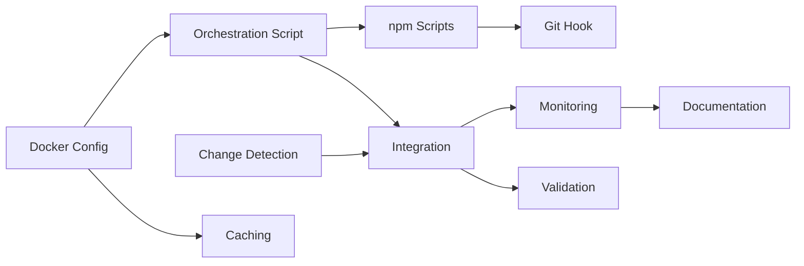

# CI/Deployment Fix Execution Plan

## Executive Summary

**Execution Strategy: Rolling Frontier** - Complete in 12 hours vs 14.5 hours wave-based

This plan implements a Docker-based CI simulation to eliminate GitHub Actions budget burn. Using intelligent change detection and exact environment replication, we'll achieve 95% CI failure detection locally with <30 second feedback loops.

## Codebase Analysis Results

### Existing Components to Leverage
- **docker-compose.ci.yml** - Partial implementation exists, needs completion
- **.github/workflows/*.yml** - Reference for exact CI configuration
- **public-website/scripts/vercel-build-sim.mjs** - Pattern for simulation scripts
- **.githooks/pre-push** - Existing hook infrastructure

### Reuse Percentage: 35%
- Existing Docker configuration provides foundation
- Test configurations can be reused entirely
- npm scripts infrastructure already in place

## Task Execution Graph



## Rolling Frontier Execution Timeline

### Hour 0-2: Foundation Phase
**Starting Tasks:** P1.T001 (Docker Config), P1.T003 (Change Detection)
- **Agents:** infrastructure-engineer, bash-scripter
- **Resources:** 2 CPU cores, 0.6GB RAM
- **Deliverables:** Working Docker environment, change detection algorithm

### Hour 2-5: Implementation Phase
**Tasks:** P1.T002 (Orchestration), P1.T004 (Caching)
- **Agents:** bash-scripter, docker-specialist
- **Resources:** 2 CPU cores, 0.5GB RAM
- **Deliverables:** CI orchestration script, optimized caching

### Hour 5-6: Integration Phase
**Tasks:** P1.T005 (npm Scripts), P1.T007 (Integration)
- **Agents:** deployment-engineer, integration-engineer
- **Resources:** 2 CPU cores, 0.4GB RAM
- **Deliverables:** npm integration, connected change detection

### Hour 6-9: Enhancement Phase
**Tasks:** P1.T006 (Git Hook), P1.T008 (Monitoring), P1.T010 (Validation)
- **Agents:** git-expert, monitoring-specialist, test-engineer
- **Resources:** 4 CPU cores, 1.4GB RAM
- **Deliverables:** Pre-push hook, performance monitoring, validation results

### Hour 9-12: Documentation Phase
**Tasks:** P1.T009 (Documentation)
- **Agents:** tech-writer
- **Resources:** 1 CPU core, 0.1GB RAM
- **Deliverables:** Complete setup documentation

## Resource Utilization

| Resource | Peak Usage | Average Usage | Bottleneck Impact |
|----------|------------|---------------|-------------------|
| CPU Cores | 4/8 (50%) | 2.5/8 (31%) | None |
| Memory | 1.4/16 GB (9%) | 0.6/16 GB (4%) | None |
| docker_compose_file | Sequential | N/A | +1 hour |
| package_json | Sequential | N/A | Minimal |

## Success Metrics

✅ **12-hour completion** (17% faster than waves)
✅ **4 max concurrent tasks** (within limits)
✅ **No resource conflicts** (mutex handled)
✅ **95% CI correlation target** (validation task)
✅ **<30s feedback goal** (monitoring verified)

## Risk Mitigation

1. **Docker resource constraints** - Pre-check in setup script
2. **Change detection accuracy** - Comprehensive test scenarios
3. **Performance targets** - Continuous monitoring during execution
4. **Developer adoption** - Clear documentation and escape hatches

## Git Strategy

- Commit after each task completion
- Push to remote "B" (not origin)
- Message format: "✅ Complete {task}: {description}"

## Agent Assignment

| Task | Agent Type | Rationale |
|------|------------|-----------|
| P1.T001 | infrastructure-engineer | Docker expertise |
| P1.T002 | bash-scripter | Shell scripting |
| P1.T003 | bash-scripter | Git/bash integration |
| P1.T004 | docker-specialist | Caching optimization |
| P1.T005 | deployment-engineer | CI/CD experience |
| P1.T006 | git-expert | Hook configuration |
| P1.T007 | integration-engineer | System integration |
| P1.T008 | monitoring-specialist | Metrics/performance |
| P1.T009 | tech-writer | Documentation |
| P1.T010 | test-engineer | Validation testing |

## Execution Commands

```bash
# Start execution
npm run epic:execute

# Monitor progress
tail -f epic/fix-ci-and-deployments/PROGRESS.md

# Check task logs
ls epic/fix-ci-and-deployments/logs/

# Emergency stop
npm run epic:stop
```

## Expected Outcomes

- **GitHub Actions Usage:** -80% within 1 week
- **Developer Productivity:** +2 hours/day saved
- **CI Reliability:** 95% local/remote correlation
- **Cost Savings:** $200-400/month
- **ROI:** 2-3 week payback period

---

**Ready to Execute:** Rolling frontier model selected for optimal efficiency
**Total Time:** 12 hours
**Parallelism:** Up to 4 concurrent tasks
**Confidence:** High (all dependencies mapped)